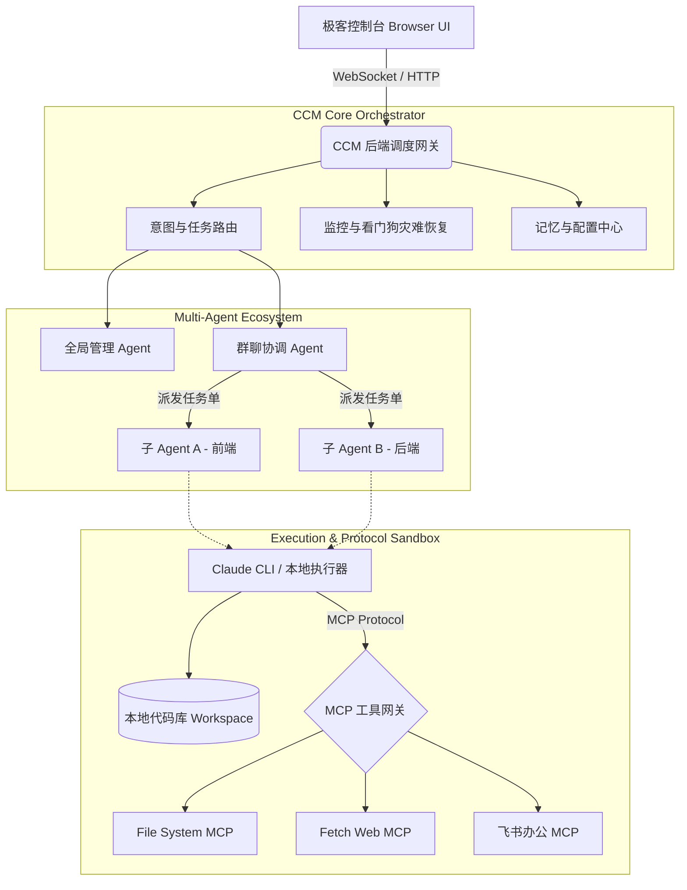
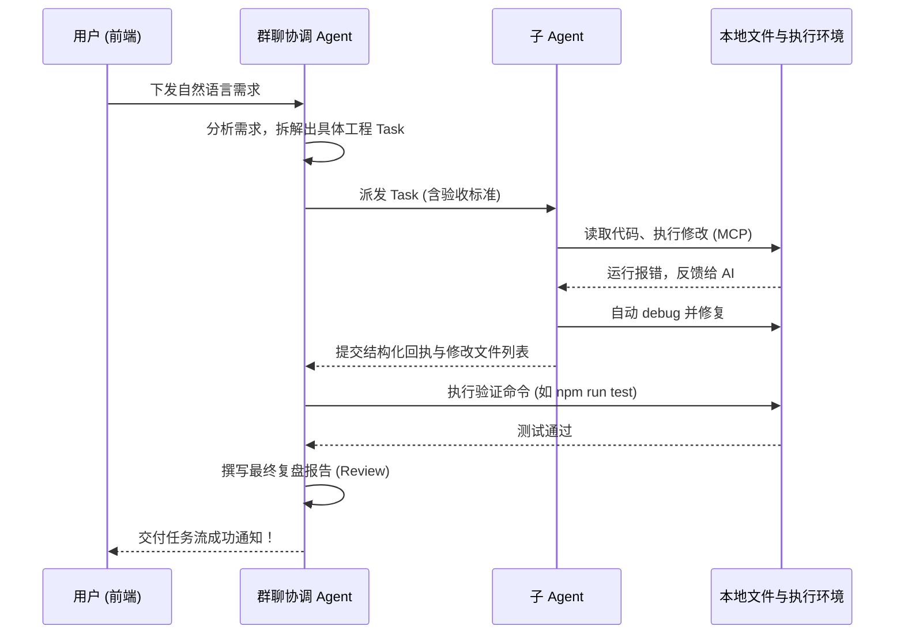

# 🚀 cc-web (Connect & Control Manager)

<p align="center">
  
  
  
  
  
</p>

<p align="center">
  <b>极客风的本地大模型多 Agent 协作工作区与可视化调度台</b><br>
  让复杂的 AI Agent 任务派发、执行、门禁验收与灾难恢复变得触手可及。
</p>

---

## 🌟 核心理念与亮点

**cc-web** 不仅仅是一个套壳的前端面板，它是一整套**企业级单机 AI 协作基础设施**。它打破了传统“单体 LLM 对话框”的限制，通过引入流水线式的多 Agent 协同机制，结合本地真实的执行环境，让 AI 真正成为您的**全自动外包开发团队**。

### 🎨 极致的极客风 UI 设计 (Glassmorphism & Cyberpunk)
摒弃传统的后台管理系统样式，我们采用了次世代的设计语言：
- **全息玻璃态界面 (Glassmorphism)**：底层模糊、自适应光效卡片，所有界面如悬浮玻璃般通透。
- **动态微交互与暗黑模式**：午夜蓝深色主题 (Dark Mode)，流光按钮，数据加载微动效，专为长时间沉浸式开发的极客打造。
- **Web 原生操作体验**：内置美观的系统级文件管理器、XTerm 虚拟终端、代码高亮审查面板，全程无需离开浏览器。

---

## 🤖 多 Agent 分级协作体系

我们定义了极其严密的职责边界，确保 AI 团队不会“乱套”：

1. 🌐 **全局主入口 (Global Agent)**：
   用户意图的第一接触点，负责管理群聊、配置工具、调度路由。它像产品经理一样，将非结构化的需求梳理后分配给对应的部门群聊。
2. 👨‍💼 **群聊协调者 (Group Coordinator)**：
   它在特定群聊内工作，负责拆解大型史诗级需求 (Epic)。它会将任务拆分成具体工单，派发给不同的底层子 Agent，并负责最后的代码门禁验收与复盘报告。
3. 👷‍♂️ **执行子 Agent (Worker Sub-Agent)**：
   干脏活累活的“打工人”。它们被绑定在本地真实的项目目录中，基于 `Claude CLI` 等沙盒执行器运行，直接修改代码并提供结构化的回执。
4. ⚙️ **规则兜底引擎 (Coded Orchestrator)**：
   非 LLM 的本地确定性规则调度器。处理任务去重、依赖等待阻塞、执行失败后的自动续跑等硬核调度。

---

## 🚀 史诗级功能特性

### 1. ⚙️ 自动开发与看门狗 (AutoDevOps & Watchdog)
真正实现“无人值守”的自动接单与容灾：
- **定时抓单 (Autopilot)**：通过 Cron 定时任务，自动扫描未认领的需求单并启动开发流水线。
- **看门狗与死锁恢复**：内置状态机监控。当检测到子 Agent 执行卡死、网络异常断开时，自动发起接管、重启执行通道并进行断点续跑。
- **真实试运行与闭环演练 (Smoke Test)**：提交生产环境前，一键自动跑通“派发->执行->回执->验收”的全闭环链路，保障高可用性。

### 2. 📊 系统自检与就绪大盘 (System Diagnostics Dashboard)
运维级的数据大盘，随时掌握 AI 团队的健康状态：
- **探针矩阵 (Probe Matrix)**：实时探测所有子 Agent 与本地宿主机的连通性、CLI 启动耗时。
- **折叠式高级诊断分析**：一键聚合 Node 子进程报错、Runner 运行日志、验证推断等海量调试信息。

### 3. 🧠 记忆控制中心 (Memory Center)
告别 AI 永远记不住上下文的痛点：
- 全局集中管理个人偏好设置、项目架构约束文档、以及各个第三方 API Key。
- **记忆穿透机制**：Agent 会在生成 Prompt 时自动挂载相关记忆库，实现全团队信息同步。

### 4. 💻 任务流水线与原生代码审查 (Task Pipeline & Code Review)
- **结构化执行报告**：任务详情页支持一键查看 Agent 交付总结、实际修改文件列表以及失败的验证命令。
- **内建 Git Diff 视图**：在「代码变更」面板，像用 VSCode 一样查看代码增删（红绿高亮）。并支持一键将变更 Commit 到本地仓库！

### 5. 🔌 MCP 生态深度集成 (Model Context Protocol)
AI 的感官与手脚无限延伸：
- `filesystem-mcp`：受控且安全的本地文件读写权限。
- `fetch-web-mcp`：赋予 Agent 联网检索、抓取文档的能力。
- `mcp-feishu`：扫码秒级绑定飞书，让 AI 直接读取办公文档或向人类同事发送汇报消息！

---

## 🏗️ 核心架构与工作流

### 系统架构图



### Agent 自动开发工作流



---

## 📦 如何安装与启动

对于绝大多数使用者，我们推荐直接通过 NPM 进行全局安装，即插即用！

### 环境准备
- Node.js >= 18.0.0
- 推荐使用现代浏览器（Chrome / Edge）以获取最佳玻璃态渲染体验。

### 快速上手 (推荐)

```bash
# 1. 全局安装 cc-web
npm install -g @mumulinya167/cc-web

# 2. 一键启动 Web 控制台
ccm start
```

启动后在浏览器打开：`http://localhost:3080`。

---

## 💻 开发者指南 (参与贡献源码)

我们非常欢迎开发者一起共建这套强大的 Agent 基础设施！

```bash
# 1. 下载源码
git clone https://github.com/mumulinya167/cc-web.git
cd cc-web

# 2. 安装全部依赖
npm install
npm --prefix frontend install

# 3. 本地全量构建与静态类型检查
npm run check
npm run build

# 4. 启动开发模式 (热更新)
# 前端服务会自动在 3081 端口启动，并无缝代理至 3080 的后端 API
npm run dev:frontend
```

> ⚠️ **关于分层架构的特别说明**: 
> 本项目严格采用了「开发态」与「运行态」分离的架构。源码位于 `backend/`、`frontend/` 及 `integrations/` 中；执行 `npm run build` 后，最终的运行时工件将被注入并打包在 `ccm-package/` 目录中。
> **请开发者绝对不要手动修改 `ccm-package/` 内的任何自动生成文件。**

---

## 📈 规划与 Roadmap (敬请期待)
- [x] 多 Agent 协作与状态流转可视化
- [x] 基于 MCP 协议的全栈工具链接入
- [x] AutoDevOps 自动化接单与死锁恢复看门狗
- [x] Glassmorphism 暗黑极客风 UI 重构
- [ ] 大模型 Token 消耗与计费成本实时大盘 (Coming Soon!)
- [ ] 更多云端 IDE 协议接入

---

## 📄 许可证

本项目基于 [MIT License](LICENSE) 开源。欢迎点亮 ⭐️ Star，提交 Issue 与 PR，一起打造属于开发者的最强 AI 协作终端！
