# 🚀 cc-web (Connect & Control Manager)

<p align="center">
  
  
  
  
  
</p>

<p align="center">
  <b>极客风的本地大模型多 Agent 协作工作区与可视化调度台</b><br>
  让复杂的 AI Agent 任务派发、执行、门禁验收与灾难恢复变得触手可及。
</p>

---

## 📑 目录导航

<details>
<summary><b>点击展开完整目录</b></summary>

- [🌟 核心理念与亮点](#-核心理念与亮点)
- [🤖 多 Agent 分级协作体系](#-多-agent-分级协作体系)
- [🚀 全量功能特性详解](#-全量功能特性详解)
  - [1. ⚙️ 自动开发与看门狗](#1-️-自动开发与看门狗-autodevops--watchdog)
  - [2. 💻 任务流水线与原生代码审查](#2--任务流水线与原生代码审查-task-pipeline--code-review)
  - [3. 📊 系统自检与就绪大盘](#3--系统自检与就绪大盘-system-diagnostics-dashboard)
  - [4. 🧠 记忆控制中心](#4--记忆控制中心-memory-center)
  - [5. 🌐 全局智能助手](#5--全局智能助手-global-agent)
  - [6. 🔌 MCP 生态与插件市场](#6--mcp-生态深度集成与插件市场-mcp-ecosystem--marketplace)
  - [7. 📚 RAG 本地知识库引擎](#7--rag-本地知识库引擎-local-knowledge-base)
  - [8. 📋 需求分析与智能分解](#8--需求分析与智能分解-requirement-analysis--decomposition)
  - [9. 💬 多端社交平台聚合协作](#9--多端社交平台聚合协作-multi-channel-integrations)
  - [10. 🔍 全域对话搜索引擎](#10--全域对话搜索引擎-unified-conversation-search)
  - [11. 📅 定时任务与工作日志](#11--定时任务与工作日志-cron-scheduling--work-journal)
  - [12. 📝 提示词模板库](#12--提示词模板库-prompt-template-library)
  - [13. 🎮 极客彩蛋与沉浸式陪伴](#13--极客彩蛋与沉浸式陪伴-geek-perks--desktop-pets)
  - [14. 🗄️ 纯本地无痕存储](#14-️-纯本地无痕存储-database-free-architecture)
  - [15. 🔧 多 Agent 运行时统一适配](#15--多-agent-运行时统一适配-multi-runtime-compatibility)
  - [16. 📊 我的工作台与拖拽看板](#16--我的工作台与拖拽看板-dashboard--kanban)
  - [17. 🧹 清理中心与存储治理](#17--清理中心与存储治理-cleanup-center)
  - [18. 🧭 导航菜单自定义管理器](#18--导航菜单自定义管理器-menu-manager)
  - [19. 🔧 项目管理与会话生命周期](#19--项目管理与会话生命周期-project-management)
- [🏗️ 核心架构与工作流](#️-核心架构与工作流)
- [📦 如何安装与启动](#-如何安装与启动)
- [💻 开发者指南](#-开发者指南-参与贡献源码)
- [📈 规划与 Roadmap](#-规划与-roadmap-敬请期待)

</details>

---

## 🌟 核心理念与亮点

**cc-web** 不仅仅是一个套壳的前端面板，它是一整套**企业级单机 AI 协作基础设施**。它打破了传统"单体 LLM 对话框"的限制，通过引入流水线式的多 Agent 协同机制，结合本地真实的执行环境，让 AI 真正成为您的**全自动外包开发团队**。

### 🎨 极致的极客风 UI 设计 (Glassmorphism & Cyberpunk)

<p align="center">
  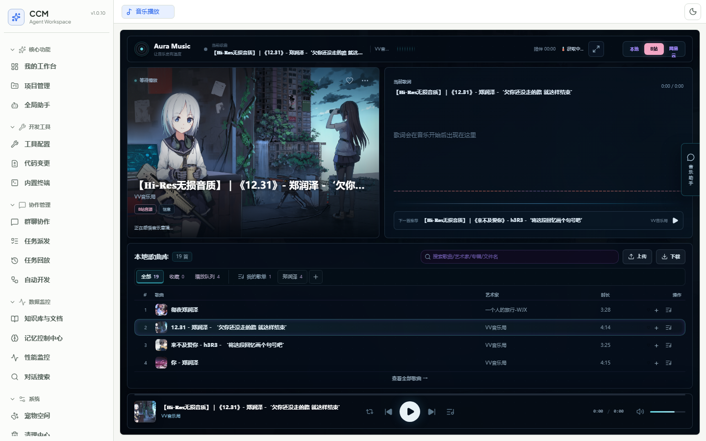
  <br><em>沉浸式音乐播放器 — Glassmorphism 暗黑风设计示例</em>
</p>

摒弃传统的后台管理系统样式，我们采用了次世代的设计语言：
- **全息玻璃态界面 (Glassmorphism)**：底层模糊、自适应光效卡片，所有界面如悬浮玻璃般通透。午夜蓝深色底色 (`#0a0e1a`)，电光蓝 (`#00d4ff`) 高亮点缀，紫罗兰梯度过渡。
- **动态微交互与暗黑模式**：流光按钮，数据加载微动效，`backdrop-filter: blur()` 半透明卡片。支持多套预设色调（`cyberpunk`、`aurora`、`deep-void`）与低性能设备友好模式。
- **Web 原生操作体验**：内置 XTerm.js 虚拟终端、Hunk 级 Side-by-Side / Unified Diff 代码审查面板、WebAudio Canvas 实时频谱可视化，全程无需离开浏览器。

---

## 🤖 多 Agent 分级协作体系

我们定义了极其严密的职责边界，确保 AI 团队不会"乱套"：

1. 🌐 **全局主入口 (Global Agent)**：
   用户意图的第一接触点。它内置了完整的 **Agentic Loop 状态机**引擎（`answer → investigate → plan → execute → needs_confirmation → complete`），负责意图识别、鉴权、跨项目路由。所有写操作需显式授权，高风险操作挂起 `waiting_confirmation` 状态等待用户确认。每次运行持久化到 `~/.cc-connect/global-agent-runs/`，携带全局唯一 `trace_id`，可在服务器重启后无缝恢复。

2. 👨‍💼 **群聊协调者 (Group Coordinator / Group Agent)**：
   它在特定群聊内扮演 **Tech Lead** 角色。接收到史诗级需求 (Epic) 后，通过 **LLM 协调器**（`group-orchestrator-llm`）进行智能任务拆解，生成包含子任务目标 (`targets`)、依赖关系 (`dependency_edges`) 与推理循环 (`reasoning`) 的结构化 JSON 计划。当 LLM 不可用时，自动降级为**规则协调器**（`group-orchestrator-coded`），基于领域关键词与本地 RAG 知识库完成保底分发。最终负责评审汇总、Code Review 与交付。

3. 👷‍♂️ **执行子 Agent (Worker Sub-Agent)**：
   干脏活累活的"打工人"。通过 `agent-worktree.ts` 在独立的 **Git Worktree** 隔离分支中并行工作，互不冲突。当多个 Agent 的写入路径存在重叠时，**冲突防护引擎**（`collaboration-resilience.ts`）会自动将并行降级为串行，并指定唯一 `mergeOwner`。每个子 Agent 执行完毕后提交结构化回执 `CCM_AGENT_RECEIPT`（含 `status`、`filesChanged`、`verification`、`blockers` 等字段）。

4. 🧪 **测试验证门禁 (Test Agent)**：
   独立的测试专员，与开发 Agent 严格隔离（防止"自证陷阱"）。在独立的 CLI 子进程中运行预验（`--plan-only`）或真实复核。能够精准区分"代码 Bug"与"环境缺失"——当检测到环境变量/登录态缺失时，走 `prepare_verification_environment` 路线生成环境预备清单，而非误判为代码问题。当发现浏览器 Provider 存在能力盲区时，自动重路由为原生 **Playwright** 执行。

5. ⚙️ **规则兜底引擎 (Coded Orchestrator & Agent Runner)**：
   非 LLM 的本地确定性调度器。处理 **FIFO 优先级队列**、任务去重（`idempotency_key`）、依赖阻塞等待、执行失败自动续跑（指数退避）。`Agent Runner` 提供基于文件队列（`~/.cc-connect/agent-runner/requests/*.json`）的离线异步执行能力，适用于进程 Spawn 受限的环境。内置心跳文件 (`heartbeat.json`) 追踪 Runner 进程状态。

---

## 🚀 全量功能特性详解

### 1. ⚙️ 自动开发与看门狗 (AutoDevOps & Watchdog)
真正实现"无人值守"的自动接单与容灾：
- **定时抓单 (Autopilot)**：通过 Cron 定时任务，自动扫描未认领的需求 Backlog（`claimReadyDailyDevBacklog`）并启动开发流水线。
- **看门狗与死锁恢复**：后台 `Task Watchdog` 定时轮询，自动检测并修复：停滞在 `pending`/`in_progress` 的超时任务、超时未更新的子 Agent 工作项（`work_item_stalled`）、临时失败可重试任务、存在交付缺口（`gap_rework`）的每日开发任务。
- **Agent CLI 引擎容错切换**：当主 Agent（如 Cursor）崩溃或返回 401/403/429 时，自动按候选优先级链（`claudecode → codex → cursor → gemini → opencode`）切换引擎，并注入上下文续跑 Prompt，防止从零重复实现。
- **服务重启自愈**：服务器重启后，自动搜寻未完成任务，使用 `acquireTaskLease` 防止多实例争抢，低风险任务自动恢复排队，高风险任务挂起 `manual_startup_recovery` 等待人工确认。
- **真实试运行与闭环演练 (Smoke Test)**：一键自动跑通"派发→执行→回执→验收"全闭环链路。

### 2. 💻 任务流水线与原生代码审查 (Task Pipeline & Code Review)

<p align="center">
  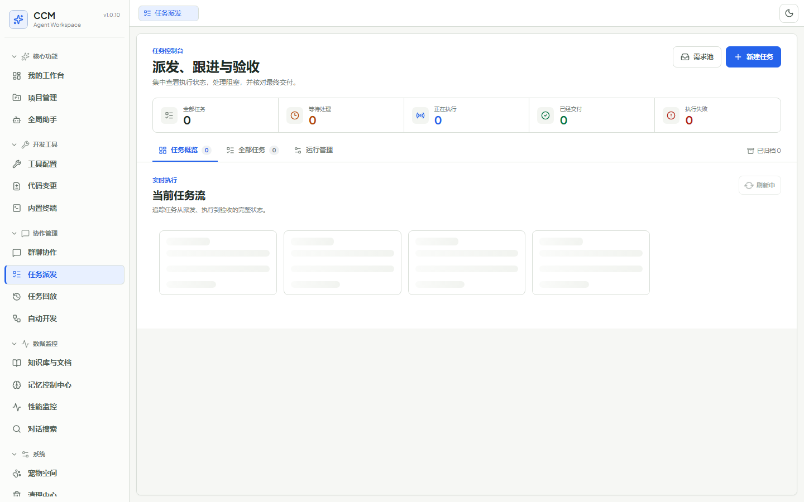
  <br><em>任务派发控制台 — 派发、跟进与验收</em>
</p>

从需求到交付的全链路可视化：
- **需求 Epic 拆解**：复杂需求自动拆解为拓扑依赖 (DAG) 的多层次子任务，建立依赖图谱 (`dependency_edges`)。需求文档版本升级时，自动 Diff 计算新增/变更/移除的子任务，保留旧版交付历史。
- **结构化执行报告**：任务详情页一键查看 Agent 交付总结、实际修改文件列表、失败验证命令、Token 消耗与费用估算。
- **内建 Git Diff 视图**：基于 Hunk 解析的高效 Diff 渲染引擎，支持 **Side-by-Side** 和 **Unified** 两种对比模式（红绿高亮），与 Agent 任务改动归属 (Task Attribution) 深度绑定。支持在浏览器中直接 Stage/Commit 到本地仓库。
- **25+ 项综合验收门禁**：`buildAcceptanceGate` 引擎校验 Coordinator 计划完整性、子 Agent 派发覆盖率、回执质量评分（0-100）、文件变更一致性、验证覆盖率、独立复核通过状态、Spot Check 抽查、记忆快照校验等。任何关键门禁未通过直接拦截任务完成。
- **Trace 重放诊断**：输入 Task ID 或 Trace ID，沿时间轴查看 `需求 → 计划 → 派发 → 执行 → 测试 → 验收` 完整 Event 链条。支持展开 Playwright 截图、浏览器日志或错误 Traceback 等法医式证据。

### 3. 📊 系统自检与就绪大盘 (System Diagnostics Dashboard)

<p align="center">
  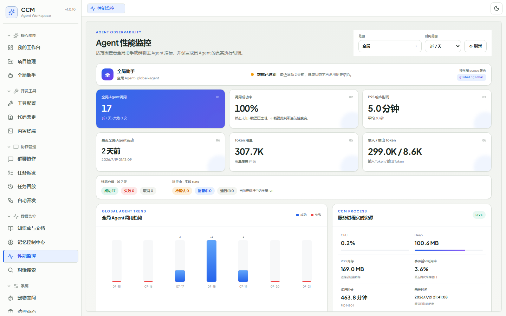
  <br><em>系统自检与就绪大盘 — 探针矩阵与资源监控</em>
</p>

运维级的数据大盘，随时掌握 AI 团队的健康状态：
- **探针矩阵 (Probe Matrix)**：实时探测所有 Agent CLI（Claude Code、Codex、Cursor、Gemini CLI、OpenCode）的安装路径、版本号、SHA256 身份 Hash 与启动耗时。
- **MCP 服务健康度**：监控所有已连接 MCP 服务器的连通性、工具发现状态、鉴权有效期（OAuth Token 过期检测）。
- **资源监控**：系统内存、CPU、磁盘空间使用情况追踪。
- **折叠式高级诊断分析**：一键聚合 Node 子进程报错、Runner 运行日志、验证推断等海量调试信息。自动识别常见错误模式并给出修复建议。
- **凭据安全保护**：所有敏感密钥自动迁移为加密协议存储（`ccm-secret://`），防止配置文件明文泄露。

### 4. 🧠 记忆控制中心 (Memory Center)
告别 AI 永远记不住上下文的痛点：
- **四层作用域隔离**：支持 Global（全局）、Group（群组共识）、Project（项目级）、Task（任务级）四个独立的记忆作用域。
- **记忆穿透机制**：Agent 在生成 Prompt 时自动挂载相关记忆库，实现全团队信息同步。通过 `Memory Context Snapshot` 与 WAL 追溯记录实现记忆消耗回执跟踪。
- **自动压缩与蒸馏**：当上下文超出 Token 预算时，使用 LLM 进行智能会话压缩（`compactProjectSessionWithModel`）。基于 `Typed Memory Ledger` 进行记忆蒸馏，按类型（决策、代码模式、偏好等）结构化存储。
- **Token 预算分配矩阵**：可视化配置各作用域的 Context Window（如 516K / 1M）与 Auto-Compact 临界点阈值。
- **群组记忆自治**：群聊对话的 Post-Turn Summary（轮后摘要）、Boundary Journal（边界日记）、Compaction Projection（压缩投影）等多级记忆管理机制，确保长期协作中上下文始终精准。

### 5. 🌐 全局智能助手 (Global Agent)

<p align="center">
  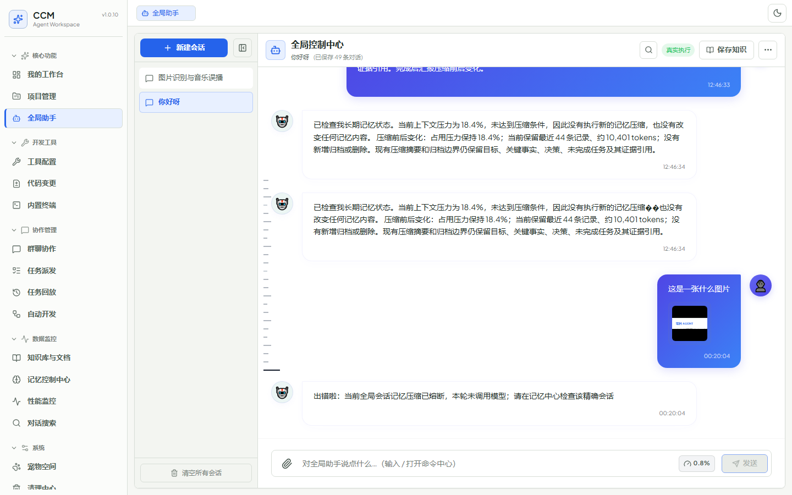
  <br><em>全局智能助手 — Agentic Loop 引擎控制中枢</em>
</p>

系统级 AI 控制中枢，不止是聊天：
- **后端 Agentic Loop 引擎**：所有交互在服务端持久化执行，无需浏览器保持打开。模型拥有完整的工具调用能力（文件读写、项目管理、任务创建、知识检索、MCP 工具调用）。
- **写授权与高风险拦截**：只读工具自动执行；写操作需用户授权；高风险操作（如删除项目、数据库迁移）挂起 `waiting_confirmation` 并渲染确认卡片，确认后仅执行原挂起的精确操作。
- **Mission Supervisor 长任务监视器**：跟踪由 Global Agent 创建的大型开发 Mission，支持周期性巡检与自动汇报进度。
- **飞书控制机器人**：动态接收飞书 Webhook 消息，同步回传交互卡片与任务状态。用户可以在飞书端直接与 Global Agent 对话并下发开发指令。
- **跨项目路由**：智能识别用户意图涉及的项目、群组或系统功能，自动路由到对应模块执行。

### 6. 🔌 MCP 生态深度集成与插件市场 (MCP Ecosystem & Marketplace)

<p align="center">
  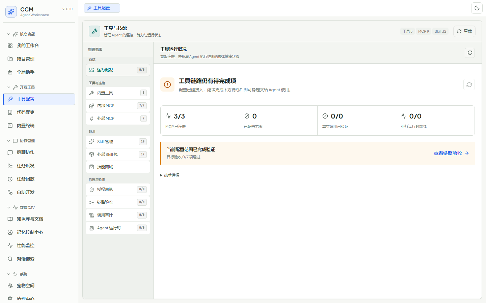
  <br><em>MCP 工具配置与 Skills 技能包管理</em>
</p>

AI 的感官与手脚无限延伸：
- **MCP 协议客户端**：标准 JSON-RPC 2.0 over Stdio 实现，支持工具发现、工具调用、反向请求安全拦截（`elicitation`/`consent`/`auth` 请求返回 `-32000` 错误码，防止外部 MCP 绕过 CCM UI 擅自触发用户交互）。
- **运行时工具同步与门禁系统**：在 Agent 启动前，将 MCP 工具和 Skills 根据权限作用域物理投影到隔离目录（`~/.cc-connect/agent-runtime/<runtime>/<snapshotId>/`）。全量授权的服务器直接 Native 加载；仅部分授权的服务器自动回退为 Proxy-only 代理模式，防止权限溢出。通过 Catalog Revision Hash 检测工具快照过期并自动 Resync。
- **Smithery 市场集成**：原生对接 MCP 插件市场，支持一键搜索、预览、安装、升级与卸载。安装时自动处理依赖配置与授权影响分析。
- **内置 MCP 服务**：`filesystem-mcp`（受控文件读写）、`fetch-web-mcp`（联网检索）、`mcp-feishu`（飞书集成）。
- **Skills 技能包**：可复用的 Prompt 指令片段，支持 CRUD 管理与别名映射，可按项目粒度分配。

### 7. 📚 RAG 本地知识库引擎 (Local Knowledge Base)

<p align="center">
  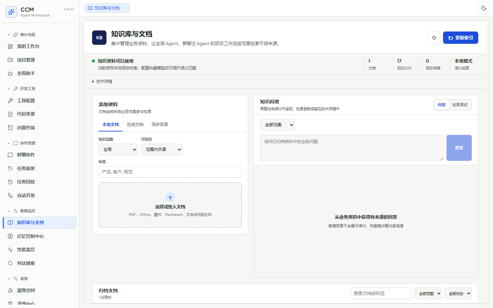
  <br><em>RAG 本地知识库 — 文档索引与检索</em>
</p>

让 AI 真正懂你的代码：
- **TF/TF-IDF 轻量级检索引擎**：无需依赖外部重型向量数据库（无 Pinecone/Weaviate 依赖），使用词频/逆文档频率算法完成文档切片、索引与相似度匹配。
- **多格式文档支持**：Markdown、TXT、PDF（pdf-parse）、Word DOCX（内置 OOXML 解析器，免依赖解压直读）、CSV、JSON。还支持从在线 URL 导入文档。
- **实时增量索引**：自动监听 `~/.cc-connect/knowledge/` 目录变动，文件修改后实时增量重建索引。
- **Agent 上下文自动注入**：当 Agent 处理任务时，系统自动检索相关知识片段并注入到 Prompt 上下文，实现精准的代码库理解。
- **RAG 查询调试工作区**：在前端界面实时测试检索效果，预览文档切片与相似度评分。

### 8. 📋 需求分析与智能分解 (Requirement Analysis & Decomposition)
从文档到任务的全自动流水线：
- **多源文档摄取**：支持上传 PDF、Word、Markdown、TXT、图片（基于 Vision 视觉大模型 OCR）、在线网页文档。
- **结构化需求提取**：LLM 自动识别业务目标 (Business Goal)、交付范围 (Scope)、验收标准 (Acceptance Criteria)、依赖与风险 (Risks & Dependencies)。
- **DAG 拓扑任务拆解**：将大需求拆解为多个并行/串行的子项，自动推荐匹配的 Group 或 Project 以及所需的 Agent 技能。生成的 Epic 任务自动灌入协作模块进行团队分发。
- **Plan Mode 安全预检**：高风险操作（破坏性修改、数据库迁移、跨项目操作）强制进入 Plan Mode，生成执行前计划与澄清问题 (Clarification Questions)，等待用户确认后方可派发。

### 9. 💬 多端社交平台聚合协作 (Multi-Channel Integrations)

<p align="center">
  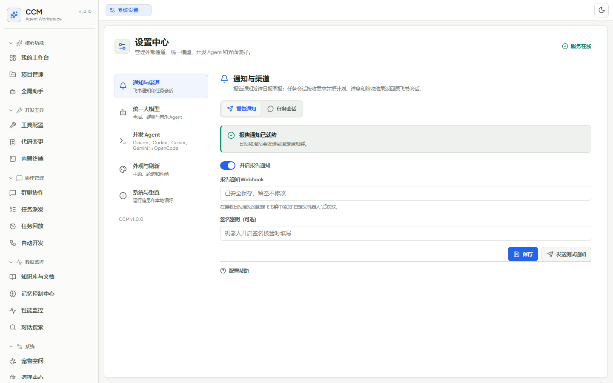
  <br><em>系统设置 — Agent Provider 管理与飞书通道配置</em>
</p>

打破内部协作的信息孤岛：
- **飞书深度集成 (mcp-feishu)**：独立的 ESM MCP Server（`@modelcontextprotocol/sdk` + `StdioServerTransport`），支持：
  - QR 扫码快捷认证 OAuth 登录。
  - `list_chats`：列出机器人加入的飞书群聊。
  - `get_chat_history`：拉取指定群聊历史消息（支持时间范围过滤）。
  - `search_messages`：群聊消息关键词搜索。
  - `get_message_detail`：获取单条消息完整富文本与附件。
  - 双向消息同步：AI 开发进度、测试报告直接以群消息推送给人类同事。
  - 可作为 MCP Server 供 Agent 调用，也可作为独立 CLI 工具使用。
- **飞书控制机器人**：接收飞书 Webhook 事件，在飞书端直接与 Global Agent 对话。
- **架构层扩展**：已预留 WeChat、Telegram、Slack、Discord、DingTalk 等主流 IM 接入能力。

### 10. 🔍 全域对话搜索引擎 (Unified Conversation Search)
一站式检索所有历史记录：
- **全源聚合**：实时聚合来自项目 Session、群聊协作记录、Global Agent 历史及飞书双向消息的全部内容。
- **多维度检索与分面统计**：支持多词 AND 逻辑、短语精确匹配。按来源 (Feishu / Project / Group / Global)、角色 (User / Assistant)、日期范围过滤，自动返回分类计数 (Facets) 及上下文前后文消息。
- **噪声抑制**：自动识别并合并系统自动生成的欢迎会话，消除重复搜索噪声。
- **深度链接导航**：搜索结果支持点击直接跳转到对应的项目/群聊/消息位置并高亮。

### 11. 📅 定时任务与工作日志 (Cron Scheduling & Work Journal)

<p align="center">
  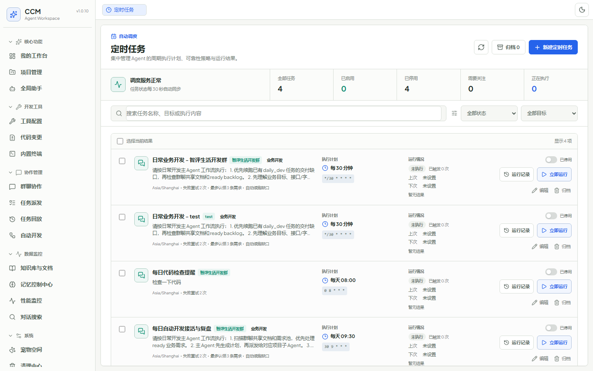
  <br><em>Cron 定时任务调度与工作日志</em>
</p>

无人值守的自动化调度：
- **Cron 调度引擎**：内存级秒/分精准触发器，支持标准 Cron 表达式。可视化编辑器配置调度规则。
- **每日开发日报自动生成**：自动扫描完成的任务与 Git 提交，汇总生成每日工作日志（Work Journal）。通过配置自动将日报/周报通过飞书推送给指定接收人。
- **Backlog 自动补充**：定时检查未完成的 Daily Dev 需求 Backlog，自动灌入任务队列执行。
- **执行历史追溯**：每次 Cron 触发的执行历史与结果完整保留，支持手动触发与批量管理。

### 12. 📝 提示词模板库 (Prompt Template Library)
高效复用的 Prompt 工程：
- **8 大预设场景模板**：覆盖前端开发、后端 API、Bug 修复、代码审查、前后端联调、代码重构、功能规划、数据库设计等典型开发场景。
- **变量占位符**：模板支持 `{页面名称}`、`{接口路径}` 等变量替换，一键填充。
- **分类管理**：`development`（开发）、`maintenance`（维护）、`review`（审查）、`collaboration`（协作）、`planning`（规划）及 `custom`（自定义）分类。
- **智能升级**：用户自定义修改过的模板被保留，未修改的旧版本自动升级到最新代码预设。

### 13. 🎮 极客彩蛋与沉浸式陪伴 (Geek Perks & Desktop Pets)

<p align="center">
  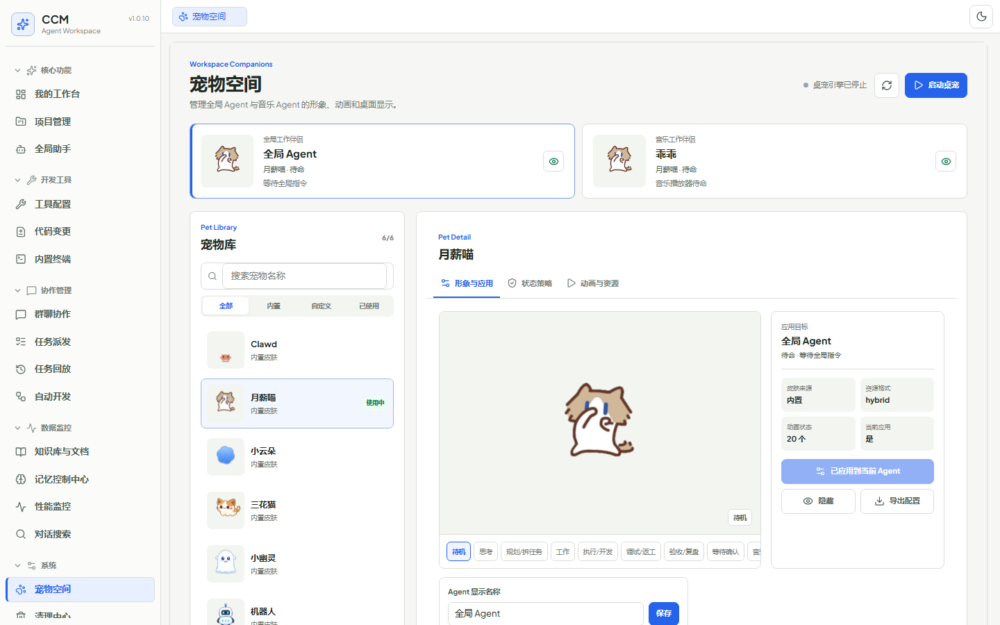
  <br><em>Electron 桌面宠物 — 陪伴你的全自动开发流</em>
</p>

开发也可以很优雅：
- **Electron 桌面宠物**：
  - 独立 Electron 进程控制，桌面悬浮交互式挂件。
  - 多状态动画（SVG/Sprite 双引擎）：根据系统活动（编码中、测试中、空闲）切换宠物表情与气泡台词。
  - 通过 SSE 实时订阅后台 Agent 任务状态，代码构建成功时欢呼，测试失败时伤心。
  - 支持上传自定义宠物皮肤（带 XSS 安全校验）。
- **沉浸式音乐播放器**：
  - 集成网易云 API 与 Bilibili 搜索，使用 `yt-dlp` 进行音频流解析与格式转换。
  - **Music Agent AI 意图理解**：自然语言点歌（如"来一首适合写代码的轻音乐"），LLM 自动筛选最佳曲目。
  - WebAudio Canvas 实时频谱可视化，弹幕区实时互动。
  - 本地歌曲封面提取、离线音乐库管理及后台异步下载。
  - 后台持续播放，迷你播放器跟随导航。

### 14. 🗄️ 纯本地无痕存储 (Database-Free Architecture)
零配置，极致轻量：
- 不依赖 MySQL/PostgreSQL/Redis 等任何重型数据库。
- 所有配置、状态、日志、任务流水均以结构化 **JSON 文件**持久化在 `~/.cc-connect/`。
- **崩溃安全原子写入**：先写临时文件后执行 `rename`，写入前自动备份 `.bak` 文件，防止崩溃导致数据损坏。
- **敏感凭据保护**：API Key、App Secret 自动迁移为加密协议存储 (`ccm-secret://`)。
- **指标统计聚合器**：按 Agent、日期、作用域多维统计调用次数、成功率、耗时、Token 消耗量、估算费用 (USD)。
- 目录结构随拷随走，极致轻量。

### 15. 🔧 多 Agent 运行时统一适配 (Multi-Runtime Compatibility)
一套系统，兼容所有主流 AI 编程助手：
- **Claude Code** (`claude --permission-mode auto`)：主力 Agent，支持会话续接（`--session-id` / `--resume`）。
- **Codex CLI** (`codex exec`)：OpenAI 编程助手。
- **Cursor Agent** (`cursor-agent -p --force`)：Cursor AI 编程助手。
- **Gemini CLI**：Google Gemini 编程助手。
- **OpenCode**：开源编程助手。
- **Qoder CLI**：自定义/替代 Agent 运行时。
- **统一输出契约**：每种 Agent 的 JSON 行输出进行漂移检测（Drift Detection），防范 CLI 输出格式非预期变化。
- **版本快照**：捕获 CLI 可执行文件路径、SHA256 身份 Hash、语义化版本号，确保运行时一致性。

### 16. 📊 我的工作台与拖拽看板 (Dashboard & Kanban)
你的个人任务总控中心：
- **可视化拖拽看板**：Drag-and-Drop 拖拽任务卡片，在 Pending → In Progress → Done → Failed 四列之间流转。
- **快捷动作入口**：集成需求智能分解 Modal 与代码审查 Modal 的快速入口，一键启动工作流。
- **全局概览**：汇聚所有项目、群聊的实时任务状态，提供统一的工作鸟瞰视图。
- **Agent 流水线可视化卡片**：直观展示多 Agent 协作任务在 Intake → Dispatch → Execute → Review 各阶段的节点状态流转。

### 17. 🧹 清理中心与存储治理 (Cleanup Center)
保持系统整洁如新：
- **存储空间概览**：可视化磁盘占用、临时文件、缓存与无效工件的空间分布。
- **清理操作预检与效果预览**：在执行清理前预览将要清除的文件和释放的空间。
- **一键智能清理**：清理临时日志、过期 Worktree、已归档任务产物、Runner 历史记录。
- **清理历史追溯**：完整记录每次清理操作的时间、类型与释放空间。

### 18. 🧭 导航菜单自定义管理器 (Menu Manager)
打造你自己的专属工作台布局：
- **自由定制导航排序**：拖拽调整顶部导航栏的 Tab 排序、分组与显示/隐藏状态。
- **常用功能固定 (Pin)**：将高频使用的功能固定到导航栏首位。
- **自定义外部链接**：支持添加自定义外部 URL 链接作为菜单项。
- **导航配置导出/导入**：JSON 格式的配置备份与一键恢复。

### 19. 🔧 项目管理与会话生命周期 (Project Management)

<p align="center">
  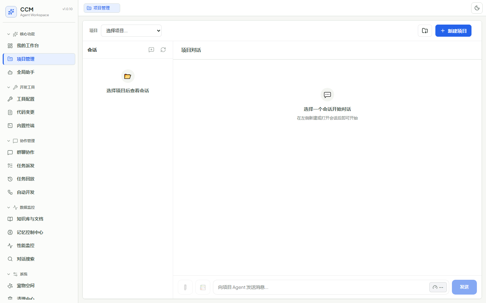
  <br><em>项目管理 — 会话、Agent 控制与代码对话</em>
</p>

每个项目的完整生命周期管理：
- **项目创建向导**：步骤化项目设置（名称、路径、Agent 类型、模型选择），支持 Git URL 直接克隆建项。
- **TOML 配置在线编辑**：浏览器内直接编辑 `.toml` 项目配置文件。
- **Agent 控制面板**：Start/Stop/Restart 按钮实时控制每个项目的 Agent 进程，配合红/绿/黄状态指示灯。
- **多 Agent 绑定**：单个项目支持同时配置多个不同类型的 Agent。
- **会话管理与世代轮转**：管理项目会话的创建、压缩（`/compact`）、消息删除与回滚时的世代旋转。
- **项目归档与恢复**：软删除/归档、恢复、预览彻底清除的完整项目生命周期操作。
- **上下文 Token 占用度量**：实时显示当前会话的 Token 消耗量与剩余 Context Window 空间。
- **会话内查找 (Ctrl+F)**：支持在长会话中对消息内容进行实时高亮定位与前后跳转。
- **斜杠命令菜单**：输入 `/` 快速唤起提示词模板与命令动作菜单（如 `/compact`、`/help`、`/clear`）。

---

## 🏗️ 核心架构与工作流

### 系统架构图

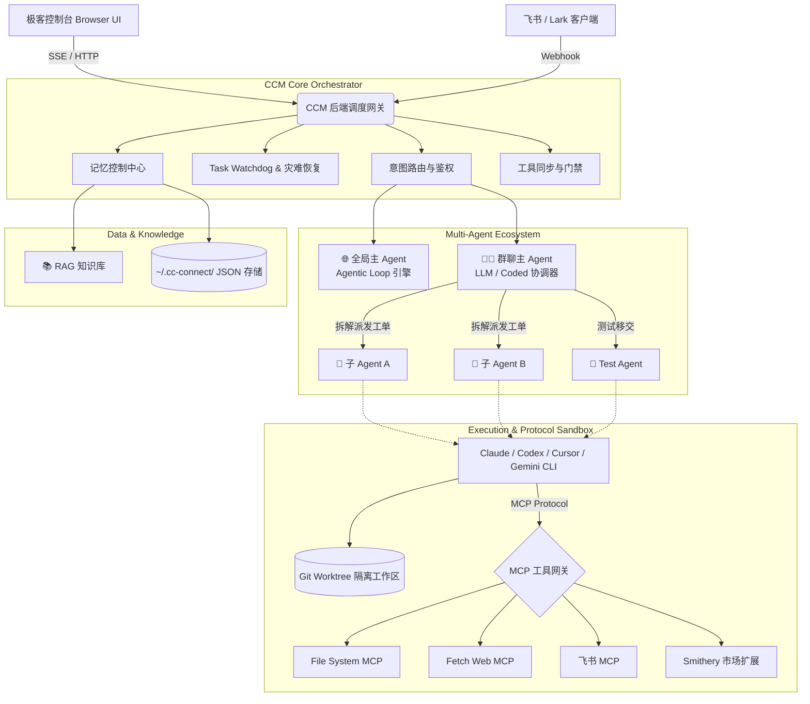

### Agent 自动开发工作流 (核心业务流程)

cc-web 采用严密的 **六阶段流水线执行闭环**：

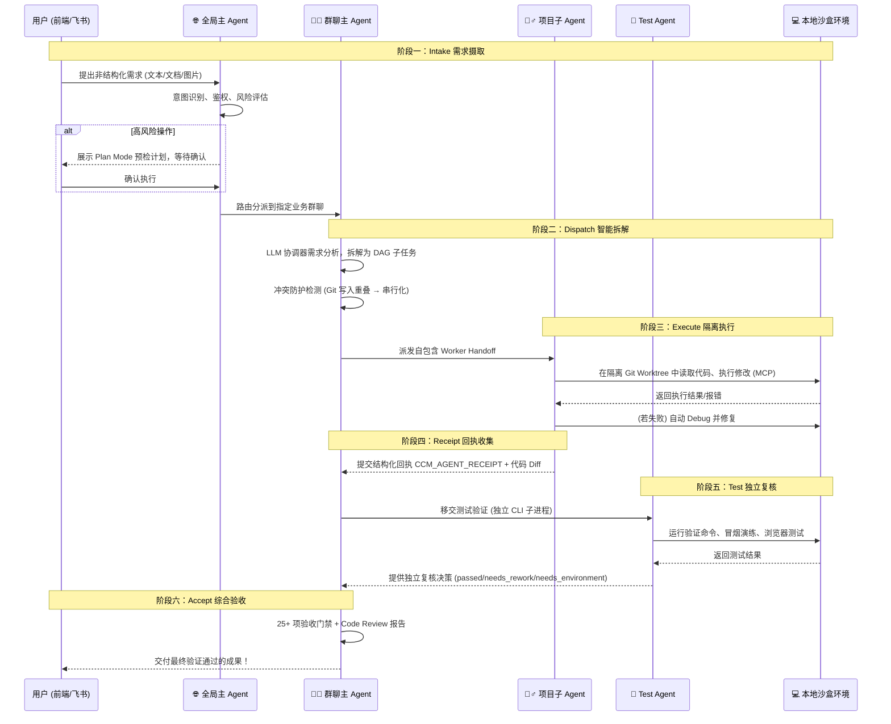

#### 📌 六阶段业务流程解析：

1. **Intake 需求摄取**：用户通过 Web 界面或飞书发送需求（支持文本、文档、图片）。全局主 Agent 进行意图识别与风险评估。对于高风险操作（破坏性修改、数据库迁移），强制进入 Plan Mode 生成执行前计划与澄清问题，等待用户确认后方可派发。

2. **Dispatch 智能拆解**：群聊主 Agent 接过需求，通过 LLM 协调器进行智能任务拆解，生成包含子任务目标、依赖关系与推理链的结构化计划。同时冲突防护引擎分析各子 Agent 的 Git 写入目标，若存在重叠则自动串行化并指定合并所有者。

3. **Execute 隔离执行**：每个子 Agent 在独立的 Git Worktree 隔离分支中工作，通过 MCP 协议与本地终端交互。遇到报错时自动 Debug 和自修复。MCP 工具授权通过物理快照方式投影到隔离目录，防止代码库污染。

4. **Receipt 回执收集**：子 Agent 执行完毕后，提交结构化回执 `CCM_AGENT_RECEIPT`（含状态、修改文件列表、验证证据、阻塞项等），系统自动解析和评分（0-100 分）。

5. **Test 独立复核**：群聊主 Agent 将变更移交给独立的 Test Agent（严格与开发 Agent 隔离）。Test Agent 在独立 CLI 子进程中运行验证命令、冒烟演练及浏览器测试。精准区分代码 Bug 与环境缺失，遇到浏览器 Provider 能力盲区时自动重路由为 Playwright。

6. **Accept 综合验收**：25+ 项综合验收门禁检查通过后，群聊主 Agent 生成 Code Review 报告并交付用户。未通过的门禁会触发返工或看门狗续跑机制。父级 Epic 任务的后继依赖自动解锁。

---

## 📦 如何安装与启动

对于绝大多数使用者，我们推荐直接通过 NPM 进行全局安装，即插即用！

### 环境准备
- Node.js >= 20.0.0
- 推荐使用现代浏览器（Chrome / Edge）以获取最佳玻璃态渲染体验。

### 快速上手 (推荐)

```bash
# 1. 全局安装 cc-web
npm install -g @mumulinya167/cc-web

# 2. 一键启动 Web 控制台
ccm start
```

启动后在浏览器打开：`http://localhost:3080`。

### 💡 初次使用指南 (Quick Start)

完成启动后，您可以按照以下步骤体验 Agent 自动开发流：

1. **配置大模型密钥**：点击左侧导航栏的「系统设置」，在 Provider 配置中填入您的大模型 API Key（支持 Claude / OpenAI / Gemini 等）。
2. **连接本地项目**：进入「项目管理」页面，点击“新建项目”，输入您本地某个待开发的代码仓库绝对路径。
3. **唤醒群聊主 Agent**：在项目中发起对话，输入您的需求，例如：*“帮我在项目中添加一个深色模式切换按钮”*。
4. **全自动流水线**：
   - 🌐 **全局助手** 会评估该意图，并将其转交。
   - 👨‍💼 **群聊主 Agent** 将自动把这个大需求拆解为若干个开发步骤（例如：更新 CSS、修改 Vue 组件、增加状态管理）。
   - 👷 **项目子 Agent** 们将被分配到独立的 Worktree 中并行编写代码。
   - 最终等待 🧪 **Test Agent** 独立复核完成后，您可以在「任务派发」面板一键查看代码 Diff 并合并！

---

## 💻 开发者指南 (参与贡献源码)

我们非常欢迎开发者一起共建这套强大的 Agent 基础设施！

```bash
# 1. 下载源码
git clone https://github.com/mumulinya167/cc-web.git
cd cc-web

# 2. 安装全部依赖
npm install
npm --prefix frontend install

# 3. 本地全量构建与静态类型检查
npm run check
npm run build

# 4. 启动开发模式 (热更新)
# 前端服务会自动在 3081 端口启动，并无缝代理至 3080 的后端 API
npm run dev:frontend
```

> ⚠️ **关于分层架构的特别说明**: 
> 本项目严格采用了「开发态」与「运行态」分离的架构。源码位于 `backend/`、`frontend/` 及 `integrations/` 中；执行 `npm run build` 后，最终的运行时工件将被注入并打包在 `ccm-package/` 目录中。
> **请开发者绝对不要手动修改 `ccm-package/` 内的任何自动生成文件。**

### 项目目录结构

```
cc-web/
├── backend/                    # 后端源码 (TypeScript, CommonJS)
│   ├── server.ts               # HTTP 服务入口 (原生 Node.js, 无 Express)
│   ├── core/
│   │   ├── db.ts               # JSON/SQLite 持久层, 原子写入
│   │   └── utils.ts            # 路径/Diff/OOXML/Multipart 工具集
│   ├── agents/
│   │   ├── runtime.ts          # 6 种 Agent CLI 统一适配层
│   │   ├── runner.ts           # 文件队列异步执行器
│   │   └── worktree.ts         # Git Worktree 隔离编排
│   ├── tools/
│   │   ├── mcp-client.ts       # MCP JSON-RPC Stdio 客户端
│   │   ├── tool-manager.ts     # 工具 & Skill 统一调度
│   │   └── runtime-tool-sync.ts # 运行时物理快照 & 门禁系统
│   └── modules/
│       ├── collaboration/      # 🔥 核心协作模块 (246 个文件)
│       ├── global/             # 全局 Agent & Agentic Loop
│       ├── projects/           # 项目管理 & 会话生命周期
│       ├── tools/              # MCP/Skills/终端/市场
│       ├── knowledge/          # RAG 知识库 & 记忆控制中心
│       ├── scheduling/         # Cron 调度 & 工作日志
│       ├── templates/          # 提示词模板库
│       ├── requirements/       # 需求分析 & DAG 分解
│       ├── search/             # 全域对话搜索
│       ├── system/             # 系统诊断 & Provider 管理
│       ├── music/              # 音乐播放器
│       └── pets/               # 桌面宠物
├── frontend/                   # 前端源码 (Vue 3 SPA + Vite)
│   └── src/
│       ├── App.vue             # 20 页面异步懒加载 + SSE 事件流
│       ├── api/index.js        # 全量 API 封装
│       └── components/         # 120+ Vue 组件 (16 个功能模块)
├── integrations/
│   └── mcp-feishu/             # 飞书 MCP Server (ESM, 独立发布)
└── ccm-package/                # ⚠️ 构建产物 (禁止手动修改)
```

---

## 📈 规划与 Roadmap (敬请期待)
- [x] 多 Agent 协作与状态流转可视化
- [x] 基于 MCP 协议的全栈工具链接入
- [x] AutoDevOps 自动化接单与死锁恢复看门狗
- [x] Glassmorphism 暗黑极客风 UI 重构
- [x] RAG 本地知识库与四层记忆控制中心
- [x] 需求 Epic DAG 拓扑分解与自动流水线
- [x] 全域对话搜索引擎
- [x] 25+ 项综合验收门禁与 Trace 重放诊断
- [x] 6 种 Agent 运行时统一适配（Claude/Codex/Cursor/Gemini/OpenCode/Qoder）
- [ ] 大模型 Token 消耗与计费成本实时大盘 (Coming Soon!)
- [ ] 更多云端 IDE 协议接入

---

## 📄 许可证

本项目基于 [MIT License](LICENSE) 开源。欢迎点亮 ⭐️ Star，提交 Issue 与 PR，一起打造属于开发者的最强 AI 协作终端！
