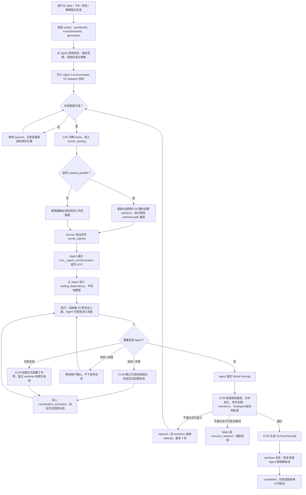

# Agent Communication V2 全链路业务流程

> 全局 Agent 到群聊/项目自动化会话的来源绑定、双向导航和终态回写，统一遵循 [自动开发端到端业务流程](./AUTOMATIC-DEVELOPMENT-END-TO-END.md) 的“全局 Agent 跨会话任务闭环”。通信账本负责执行身份和回执；任务与会话链接只是其安全投影，不建立第二套状态机。

确认日期：2026-08-08  
实现状态：已接入全局任务、项目直派、群聊跨项目协作、六类第三方运行时、任务卡、恢复与审计

## 控制面边界

CCM 是唯一通信控制面。Claude Code、Cursor、Codex、Gemini、OpenCode、Qoder 不直接互发消息；第三方 Agent 的协作请求、结果和恢复均进入 CCM 的 SQLite/WAL 消息账本，再由拥有目标作用域权限的主 Agent 仲裁。

- 全局主 Agent 选择群聊或项目，不代替项目 Agent 修改源码。
- 项目主 Agent 只能派发当前项目工作。
- 群聊主 Agent 可以在成员项目间建立依赖工作项。
- TestAgent 只做独立验收，不能转派开发。
- 第三方 Agent 只能提交 ACK、Progress、Heartbeat、Coordination Request 和 Result；Terminal 只能由 CCM 在正式验收后提交。

## 当前实际工作流程



## 信封、回执与精确身份

新数据写入 `ccm-agent-communication-envelope-v2`。每条消息绑定：

```text
taskId + workItemId + exactSessionId
+ generation + attempt + leaseId
+ senderAgentId + receiverAgentId
```

四段成功证据是：

1. Dispatch：持久信封及 payload checksum。
2. ACK：`ccm-agent-dispatch-ack-v2`，包含目标理解、允许/禁止范围、验证计划和待澄清项。
3. Result：`ccm-agent-result-receipt-v2`，包含文件、结构化验证、来源/产物引用和未完成项。
4. Terminal：`ccm-agent-terminal-receipt-v2`，仅 CCM 验收门生成。

`CCM_AGENT_RECEIPT` 文本标记继续兼容。尚未主动调用通信 MCP 的旧运行时，会从回执内的 ACK 与 Result 生成标记为兼容桥接的 V2 证据；不会允许第三方结果直接成为终态。

Agent Communication V2 同时投影到用户可见执行流：Dispatch/队列为 `agent_started`，Runner/ACK/Progress/Result待验收为 `agent_progress`，只有 CCM Terminal accepted 才成为 `agent_completed`。追加事件按 `agentRunId + taskId + workItemId + projectId + generation` 投影成一条项目行，状态原位更新；项目名称优先、Codex/Claude Code等运行时作为次要标识。该投影不改变通信状态机，也不保存第三方原始输出。页面行为见 [CC-STYLE-USER-VISIBLE-EXECUTION-FLOW.md](./CC-STYLE-USER-VISIBLE-EXECUTION-FLOW.md)。

## 状态机与时间门禁

正常流转：

```text
created -> queued -> lease_acquired -> runner_starting -> runner_started
-> acknowledged -> executing / waiting_dependency
-> result_submitted -> verifying -> accepted / rejected -> completed
```

异常状态包括 `startup_timeout`、`ack_timeout`、`heartbeat_lost`、`lease_expired`、`cancel_requested`、`recovery_required`、`stale_receipt` 和 `failed`。服务端维护合法迁移表，通用任务更新和第三方 Agent 不能跳过门禁。

默认值：Runner 启动 60 秒、ACK 30 秒、系统心跳 20 秒、失联 90 秒、lease 120 秒、最大 attempt 3、单项目并发 2、全局并发 6。项目和群聊可降低并发，不能突破全局值。

独立项目工作项在无依赖、无写路径冲突时使用稳定并行批次并以隔离结果收敛；单个项目失败不会吞掉其他项目结果。容量不足的工作项保持 `queued` 并显示真实队列位置，槽位释放后自动领取租约。第三方 Runner 的 Result 被持久接收后立即释放执行槽，CCM Terminal 验收继续使用原 generation、attempt 和 lease 身份校验，不占用运行并发。

后台 watchdog 每 5 秒核对启动、ACK、心跳和租约。无副作用时先递增 attempt、作废旧 lease、停止旧 Runner，等待执行通道释放后自动把原任务重新入队；旧 Runner 的迟到结果因 attempt/lease CAS 不匹配只能写成 `stale_receipt`。已有明确文件变化时先重验 worktree；副作用不确定时进入 `recovery_required`，不自动重复修改。

`waiting_dependency`是事件等待，不是固定轮次模型循环。ACK、Progress只更新状态和审计，Result或需要主Agent裁决的协调事件才唤醒相应会话；同一message、generation、attempt和lease的重复通知不会再次调用模型、再次修改或再次合并。

## 隔离并行与合并

`isolated_parallel` 不再落回项目主目录串行通道：

1. 基础仓库 Git 租约只覆盖 worktree 创建。
2. 执行阶段使用 `worktree:<absolute-path>` 通道，与同项目主目录任务并行。
3. 合并时重新获取基础仓库独占 Git 租约，核验分支新鲜度、差异、验证和冲突。

达到容量上限不计算 Runner 启动超时；任务保持 `queued/capacity_wait` 并显示原因。合并冲突保留 worktree 和证据，不覆盖现有修改。

## 内部 MCP

统一服务 `ccm__agent_communication` 提供：

- `acknowledge_assignment`
- `report_progress`
- `heartbeat`
- `request_coordination`
- `request_review`
- `report_blocker`
- `get_assignment_status`
- `submit_result`

`ccm__group_coordinator` 保留为兼容别名；新协调请求同时写入 V2 消息账本。所有调用重新核验任务、项目、群聊、精确会话和 HMAC 签名上下文。

## API、任务卡和数据最小化

- `GET /api/agent-communications`
- `GET /api/agent-communications/:messageId`
- `GET /api/agent-communications/diagnostics`
- `POST /api/agent-communications/:messageId/action`

管理动作支持 `cancel`、`retry`、`takeover` 和 `reconcile`；取消与接管同时触发受管 Runner 停止。任务卡展示 receiver、state、generation、attempt、心跳和租约到期时间；协议详情默认折叠。

监控同时输出 `dispatch_to_runner_started_ms`、`runner_started_to_ack_ms`、`heartbeat_lost_total`、`lease_recovery_total`、`stale_receipt_total`、`coordination_dependency_wait_ms`、`worktree_merge_conflict_total` 以及全局/项目并发占用。任务卡提供重新核验、安全重试、人工接管和停止入口，写操作仅管理员可执行。

账本与 API 只保存、返回结构化状态、checksum、证据引用和截断摘要。`prompt`、`content`、`body`、`rawOutput`、密钥、令牌和第三方 CLI 私有配置在持久化前被投影移除，`contentStored:false`。

## 重启与 V1 边界

- 新任务和新协调请求只写 V2。
- V1 终态只读展示，不伪造 ACK、心跳或 Terminal。
- V1 活跃任务恢复前重新核验作用域、授权、会话、worktree 和副作用，然后生成 `legacy_bridge` 信封并提升 generation。
- 旧 generation、attempt、lease、跨会话和乱序回执只记为 `stale_receipt`，不能覆盖当前状态。
- 旧 JSON 协调账本保留兼容读取，不在启动时自动删除。

## 实现入口与验证

- 核心账本与状态机：`backend/system/agent-communication-v2.ts`
- API：`backend/system/agent-communication-api.ts`
- 内部 MCP：`backend/integrations/agent-communication-mcp.ts`
- 任务执行与回执：`backend/modules/collaboration/collaboration-task-executor.ts`
- 跨 Agent 运行：`backend/modules/collaboration/collaboration-cross-agents.ts`
- 队列与 worktree 通道：`backend/modules/collaboration/collaboration-runtime-coordinator-review.ts`
- 重启桥接：`backend/modules/collaboration/collaboration-task-runtime.ts`
- 任务卡：`backend/modules/collaboration/collaboration-task-card.ts` 与 `frontend/src/components/tasks/TaskExperienceCard.template.html`

本地回归使用 Mock Runner，不调用付费 Provider。`agent-communication-v2-selftest.mjs` 覆盖精确身份、迟到回执、四段证据、无正文化、并发和 V1 桥接；`group-coordination-business-chain-e2e.mjs` 覆盖同项目已有任务运行时的独立 worktree 并发、合并、来源会话恢复、重启和四段证据。
# 2026-08-09 Skill Fork 与工具事件补充

`context: fork` 的 Skill 子 Agent使用父scope、exactSessionId、generation和turn建立隔离身份；父主Agent等待其Result并恢复原Loop。Provider原生tool call、JSON tool request和Fork内只读调用统一经过CCM工具指纹、RBAC和Evidence门，迟到或重复事件不能产生第二次执行。Fork只有无正文 `ccm-skill-fork-receipt-v1` 可持久化。

## 2026-08-10 第三方 Agent 结构化实时进度与严格 ACK

Claude Code、Codex、Cursor、Gemini、OpenCode 和 Qoder 统一接入 `ccm-agent-runtime-event-v1`。运行时只有在输出格式经过能力验证、且事件能够映射为普通助手说明、工具、文件变化、验证或状态事件时，才会形成用户可见进度。自由格式 stdout、thinking、reasoning、Prompt 和工具原始大输出不会被解释成业务事实；没有结构化能力的运行时保持系统见证降级。

新任务执行前必须完成真实 `acknowledge_assignment`。签名内部 MCP 上下文固定绑定：

```text
messageId + taskId + workItemId + exactSessionId
+ generation + attempt + leaseId + receiverAgentId
```

需要短 ACK 预检的运行时先在无业务副作用阶段确认任务；30 秒内没有真实 ACK 时进入 `ack_timeout`，正式 Runner 不启动。新任务不能用最终 Result 补造 ACK；旧任务仍保留明确标记的兼容桥接。每次重试重新签发 attempt 与 lease，旧签名进程不能从数据库代填成当前身份。Result 产生的 Evidence 归属实际第三方 Agent。

第三方 Agent 主动 `report_progress` 是最高优先级业务说明。若 60 秒没有语义进度，CCM 只根据已经观察到的结构化工具、文件变化或验证事实生成一次安全兜底；只有心跳时仅显示“仍在运行，等待可验证进度”，且普通心跳不重复刷屏。运行时进度只增强可观察性，不能替代 Result、RepoState、Evidence、TestAgent 或 Terminal Gate。

目标自动化会话在执行前持久化 `anchorMessageId`，跨会话任务另存 `originMessageId`。新用户事件直接携带消息锚点，前端不再依靠 15 秒时间窗绑定；历史事件仍按旧规则兼容。运行时事件在项目 Agent 父行内按 `agentRunId/toolCallId` 原位更新，完成后随该项目 Agent 收入执行记录。

Runner 原始 stdout/stderr 采用 ephemeral 模式：只在进程运行期间存在于受限临时文件，结束后先提取结构化事件、Receipt 和安全错误摘要，再删除正文。持久账本只保存字节数、checksum、截断状态、退出码与安全摘要，并在服务启动时清理已终止任务遗留的临时输出。
