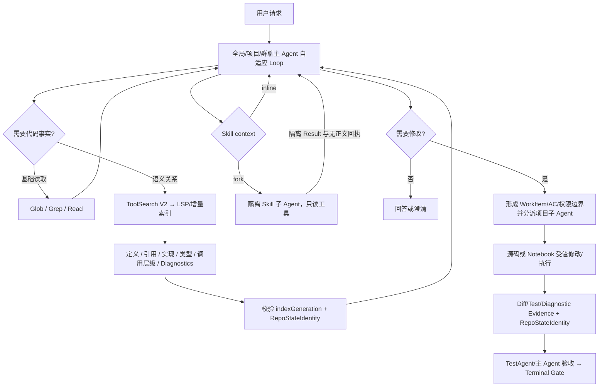

# CC 级代码智能与工具链确认流程

## 1. 已确认边界

CCM 主 Agent 负责理解、只读检索、计划、分派和最终验收；源码与 Notebook 写入仍只允许正式项目子 Agent 在绑定 WorkItem、attempt、lease 和允许路径的 worktree 中执行。任何 Provider 原生工具事件都只是请求，必须重新进入 CCM RBAC、能力令牌、去重和审计门。

## 2. 当前实际流程

## 3. 代码智能

- TS/JS/JSX/TSX 使用随包 TypeScript Language Service，第一次语义查询或管理员启动时按需建立索引。
- 每个项目拥有独立 SQLite/WAL，保存文件 hash、符号位置、诊断摘要和索引代次，不保存源码正文。
- 文件 hash 变化时只重建变化文件和受影响的语义投影；查询结果绑定当前 `RepoStateIdentity`，旧结果不得满足新的验收条件。
- Vue、Pyright、gopls、rust-analyzer、JDT LS、Kotlin、clangd、C#、PHP、Ruby、Lua、HTML/CSS/JSON服务会被发现并展示；已安装服务通过标准 LSP Definition、References、Implementation、Type Definition、Document/Workspace Symbol、Call Hierarchy 与异步 Diagnostics 请求进入相同结果契约。未安装时明确返回 `capability_unavailable`；CCM 不用文本匹配冒充语义结果，也不在启动时静默下载。
- 共享 stdio LSP Client 支持 initialize、request、notification、异步 diagnostics、超时、退出和崩溃信号；管理员可登记自定义LSP命令。

## 4. ToolSearch 与 Provider 原生工具

ToolSearch V2 按精确名称、canonical name、别名、描述词、Schema字段、当前意图、作用域、内置优先级和最近成功使用排序。未授权、断开、Schema漂移或不可信工具在评分前被排除。

OpenAI `tools/tool_calls`、Gemini `functionDeclarations/functionCall` 和 Anthropic `tools/tool_use/tool_reference` 被统一归一化为 `MainAgentToolRequest`。Anthropic Tool Reference 仅在官方端或七天内的能力证明有效时发送 beta 字段；兼容端在输出前拒绝原生字段时只回退一次 JSON Loop，已经产生输出时不重试。原生和 JSON 请求共享同一工具指纹。

## 5. Skill Fork、Notebook 与 Web

- Skill 缺少 `context` 时为 `inline`；`context: fork` 创建隔离模型上下文，只继承父 Loop 可见快照、来源引用、已加载Schema和只读授权工具，不继承隐藏执行链或密钥。父 Loop 等待隔离结果后从原会话继续；子循环由完成信号、deadline与重复无进展熔断控制，不使用固定业务轮数。
- Fork 通过 Agent Communication V2 记录 Dispatch、ACK、系统心跳、Result 与 CCM Terminal；正文结果只回当前父 Loop。独立的 `ccm-skill-fork-receipt-v1` 仅含身份、Skill hash、usage、Evidence引用和结果checksum。
- `inspect_notebook` 只返回元数据、cell ID/index、类型、行数、source checksum与输出类型。`notebook_patch/notebook_execute` 仅由项目子Agent内部MCP暴露，并生成绑定代码状态的Evidence。
- `web_fetch` 只自动访问公开HTTPS，逐跳校验DNS和重定向，阻止私网、回环、凭据URL、危险下载与超限正文；JS壳页面的浏览器回退使用无Cookie、无存储、禁下载临时上下文，并对每个子请求重新执行公网校验。
- `web_search` 只在真实 Search MCP、Brave、Bing 或 Google CSE 至少一个已配置时注册。密钥由 CCM 凭据中心加密保存，公开配置只返回各 Provider 是否已配置；网页正文仅在当前 Loop，持久化为无正文来源引用。

## 6. 与 D 盘 CC 的关系

语义目标对齐 CC 的“专用代码工具优先、ToolSearch 延迟发现、工具结果回同一 Loop、Skill 可 fork、子 Agent 修改、压缩后按校验恢复”。CCM 额外提供项目/群聊作用域、租约、Evidence Freshness、Terminal Gate和无正文审计。Provider服务端内部编辑算法、第三方CLI隐藏思考和未随反编译包提供的服务端代码不在复制范围。
