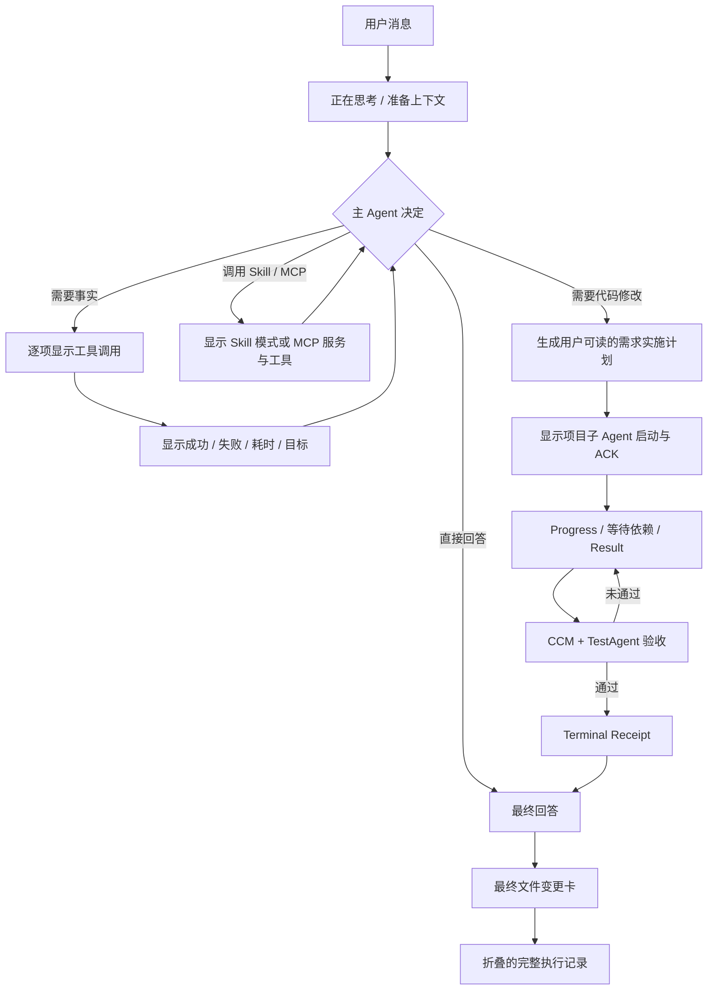

# CC 式用户可见执行流

确认日期：2026-08-09  
实现状态：全局、项目、群聊三类主 Agent 已统一接入

## 实际页面流程



页面不再用一种布局同时表示运行中和已完成：

```text
运行中：进度说明 → 当前工具批次 → 需求实施计划 → 项目 Agent → TestAgent / 返工
完成后：最终回答 → 文件变更卡 → 折叠的执行记录（含最终计划）
```

运行中不显示“执行记录”入口或 `Ctrl+O` 提示，当前过程按四个阶段直接展示，同一工具和 Agent 在原行更新状态。只有当前消息收到权威 `result` 后才切换完成布局；完成后实时过程自动收起，用户点击“执行记录”或按 `Ctrl+O` 才回放完整时间线。失败或阻塞的终态如果已有文件变化，页面显示“产生了 N 个未验收改动”，不会伪装为“已编辑”或“已完成”。

工具型请求会按 CC 的沟通节奏在正文中交错展示安全进度说明：

```text
我先检查相关项目结构和当前配置。
运行了 3 个工具 · 8秒

已经定位到实际入口，我继续核对接口与路由关系。
运行了 2 个工具 · 5秒
```

进度说明写入 `assistant_progress`。运行中它位于对应阶段内并始终可见；完成后随完整执行记录收起，展开记录时按原始时间顺序恢复。工具参数、结果、Token 和耗时仍需点击具体工具行查看。首次工具批次必须有说明，后续只在关键发现、方向变化、阻塞、返工、验收和总结等里程碑出现。同一模型轮最多一条，不逐个 Read/Glob/Grep 机械播报。

```text
准备与检索
需求实施计划
项目 Agent
独立验收
主 Agent 验收与总结
```

运行态各阶段默认展开且都可独立收起；完成态先整体折叠，打开后显示完整阶段并允许逐阶段收起。普通零工具问答仍不显示执行卡。整卡展示从用户请求到最终回答的总耗时，阶段展示墙钟耗时；并行项目 Agent 使用时间区间并集计算，不把各 Agent 耗时相加。排队与依赖等待只进入整轮总耗时，不冒充 Agent 活动耗时。

## 用户可读的需求实施计划

代码任务完成准备与检索后、项目 Agent 启动前，三类主 Agent 都写入 `requirement_plan` 事件。页面展示的是面向业务用户的实施说明，而不是 Worker Handoff、文件级操作清单或内部状态机：

```text
需求实施计划 · 第 2 版
目标：让新增的后台前端能够被群聊识别、正确读取并完成独立验收。

1. 确认现有能力与受影响范围
2. 补齐项目接入与目录读取
3. 完成页面功能与交互
4. 独立验收并修复未通过项
5. 主 Agent 汇总交付结果

实施范围：smart-live-ui、群聊项目成员接入、项目只读工具链
预期结果：群聊可识别项目；项目 Agent 可读取授权目录；验收通过后展示最终文件变化。
本次不处理：未授权项目、生产发布和跨项目数据迁移。
```

事件使用 `ccm-user-visible-requirement-plan-v1`，只保存 `planId/revision/title/goal/steps/scope/expectedResults/exclusions/status/checksum` 和时间，不保存源码、Prompt、工具正文或内部协议。步骤描述必须使用用户能够理解的业务语言；具体文件、命令、租约、Evidence 和第三方 Agent 私有配置仍留在权威任务与通信账本中。

计划在首次正式分派前生成；主 Agent 重规划时使用同一 `planId` 递增 `revision`，页面默认显示最新版本，并在“计划历史”中保留旧版本的只读状态。任务完成后，最终计划不会消失：完成布局仍保持“最终回答 → 文件变更卡 → 折叠执行记录”，用户展开执行记录后可在准备与检索和项目 Agent 之间查看计划、最终完成状态及修订次数。普通问答、没有实施步骤的工具查询和澄清请求不生成计划卡。

## 完成交付与文件审查

成功 Result 的 `detail.fileChanges` 只保存当前 generation、当前 accepted attempt 的最终文件元数据：`path/project/status/additions/deletions/binary/deleted`。项目任务取最终验收后的 `actual_file_changes`，群聊聚合各项目正式交付，全局任务从最终 Delivery Report 投影；最多保存 100 条，不保存 Diff 或源码正文。

完成卡按 `project + path` 去重并稳定排序，默认显示 3 项，卡内最多展开 40 项。跨项目同名路径必须保留为不同文件。点击文件或“审核”打开现有代码改动抽屉，由 `/api/git/diff` 重新读取当前项目的权威 Diff；仓库漂移、权限撤销、文件删除或没有可核验项目身份时明确提示不可读取。页面不提供没有正式 checkpoint 的伪撤销。

## 统一事件协议

用户可见投影写 `ccm-user-visible-agent-event-v1`。事件绑定 `scope + scopeId + exactSessionId + generation`，工具事件附带 `toolCallId`，子 Agent 事件绑定 `agentRunId + taskId + workItemId`，并携带无正文 `agentDisplay`（项目、运行时、工作项、阶段、attempt、队列位置和并行批次）。统一查询和实时接口为：

- `GET /api/agent-execution/events`
- `GET /api/agent-execution/events/stream`

SSE 支持事件 ID、cursor、重连补发和事件去重。全局原有工具事件、项目隐藏执行账本、群聊工具循环及 Agent Communication V2 都只是投影来源；任务、通信、租约、Evidence 和 Terminal 状态仍由原权威账本决定。

三类主 Agent 的用户可见文本都进入同一实时事件通道：项目直接转发安全回复 delta；全局与群聊因为模型内部使用结构化决策 JSON，只在协议解析并提取用户回复后发布 `assistant_text_delta`，禁止把内部 JSON、reasoning 或工具参数流给页面。该事件 `sequence=0`，只发送给当前 SSE 订阅者，不进入磁盘回放。

Provider 原生响应中的普通文本与工具调用必须同时保留：Anthropic 的 `text + tool_use`、OpenAI 的 `content + tool_calls` 和 Gemini 的 `text + functionCall` 都先把普通文本投影为进度，再执行工具。JSON 兼容路径使用 `progressUpdate + progressKind` 获得相同语义，不增加额外模型调用。进度完成后聚合写入持久事件，最长 600 字符，并按 `modelCallIndex + milestoneChecksum` 幂等去重。

群聊自动压缩只有在 SQLite/文件事务、Boundary 和恢复清单全部提交成功后，才写入 `context_compacted` 投影。投影记录 Boundary checksum、恢复 token 和原因，不保存摘要正文；展示投影失败也不得反向改变已经提交的压缩状态。

## 工具与 Agent 展示

- Read、Search、Definition、References、Implementations、Type Definition、Incoming/Outgoing Calls 和 Diagnostics 使用稳定的人类可读名称。
- MCP 显示服务与工具；Skill 显示 `inline` 或 `fork` 执行语义。
- 第三方 Agent 显示排队、启动、ACK、执行、等待依赖、Result 待验收和 CCM Terminal。
- 同一项目工作项的生命周期只显示一行；终态覆盖旧执行/等待状态，重试显示当前 attempt，历史 attempt 仅在该行详情中查看。
- 群聊多项目以“项目名 · 运行时”显示，只有同一批次至少两个项目真实并发时才显示并行标识。
- Worker Result 只能显示“等待验收”；只有 Terminal Gate 通过后才能显示“任务已完成”。
- Provider 原生工具与 JSON 工具循环使用同一调用指纹，不得重复执行或重复显示。
- TestAgent 按 `taskId + project + generation` 合并为一行，`reviewCycleId` 和 attempt 保留在轮次详情中。未通过的旧 attempt 收入“轮次历史”，原项目 Agent 使用同一 work item 增量返工；复验通过之前不得出现主 Agent 总结或完成状态。
- TestAgent 通过后，任务先进入 `main_agent_accepting`，页面才显示“主 Agent 验收与总结”。主 Agent 完成最终门禁和交付总结后才写入 Result 与最终助手回答；该投影失败不会反向影响权威任务状态。
- 项目 Agent 回执中的文件变化显示相对路径与 `+/-` 统计。完成后的最终文件卡只取 Result 中当前有效 attempt 的权威集合，旧 attempt 和迟到 generation 不得混入。点击文件行会打开统一代码变化抽屉，默认查看单栏 Diff，并可切换左右对照或完整文件；内容从当前项目权威 Git 工作区按需读取，不从事件账本回放旧源码。权限撤销、文件删除、路径漂移或尚未合并的隔离 worktree 无法形成当前项目 Diff 时，页面明确显示不可用，不读取其他项目或错误目录。

## 可见性与安全

实时文本增量只经 SSE 传输，不写入事件投影；最终助手文本继续由会话消息存储。事件持久化禁止包含系统 Prompt、Worker Handoff Prompt、密钥、隐藏思维链、原生 session ID、知识/共享文件/网页/Notebook正文、源码 Diff 和工具原始大输出。文件变化只保存路径、项目、状态与增删统计；上述正文只保存安全摘要、引用与 checksum，查看时重新读取当前权威来源。

进度说明不是思维链：它只描述用户可理解的下一步、关键发现或验收状态。原始 thinking、reasoning、协议 JSON 和 Prompt 始终不展示。普通零工具问答仍只显示“正在思考”与最终回答。历史 `executionMessages`、`workEvents` 和 `streamEvents` 由前端兼容适配，不自动迁移。关闭 `ccStyleAgentProgressNarrationEnabled` 后回退为“正在思考＋工具记录＋最终回答”；关闭 `ccStyleExecutionDisplayEnabled` 后恢复原页面展示。

## 验证

- `npm run test:cc-execution-display`
- `npm run test:cc-execution-display:e2e`
- `npm run test:cc-execution-display:visual`
- `npm run check`
- `npm run build:frontend`

专项自测验证密钥与正文哨兵不进入投影、事件幂等、三作用域实时增量不落盘、群聊压缩提交后投影，以及三类页面共用同一执行流组件。

业务链 E2E 使用真实 Communication V2 和任务状态账本验证：`准备与检索 → Worker Dispatch/ACK/Result → TestAgent 第1轮失败 → 原Worker增量返工 → TestAgent复验通过 → 主Agent最终验收与总结 → 最终交付`。其中 Worker Result 必须显示“等待 CCM 验收”，最终交付必须晚于独立验收通过和主 Agent 总结。

群聊内的项目子 Agent 按 `taskId + workItemId + projectId + generation` 投影为单行，并在原位更新为“排队 / 启动中 / 等待 ACK / 执行中 / 等待依赖 / 等待权限确认 / 等待 CCM 验收 / 完成 / 失败 / 需要接管”。标题中的“执行中”只统计 phase 已进入 `executing` 的项目；只有同一并发批次中至少两个项目同时处于该阶段时才显示“并行执行”。因此三个互不依赖且容量充足的项目应显示为“3 个项目 Agent · 3 个执行中 · 并行执行”，容量、依赖、权限或验收门禁造成的等待会显示精确原因，不再笼统写成“1 个等待”。

视觉回归使用生产 Vue 组件，覆盖运行中直接展示、完成折叠、完成展开、单文件/整批审核、`Ctrl+O` 和 390×844 移动端；验证最终回答在文件卡和执行记录之前、无横向溢出、移动端隐藏键盘提示且敏感 Handoff 与 Diff 正文不可见。截图输出到 `scratch/cc-execution-display-render/`，不作为产品持久数据。自动化测试不调用付费 Provider。
