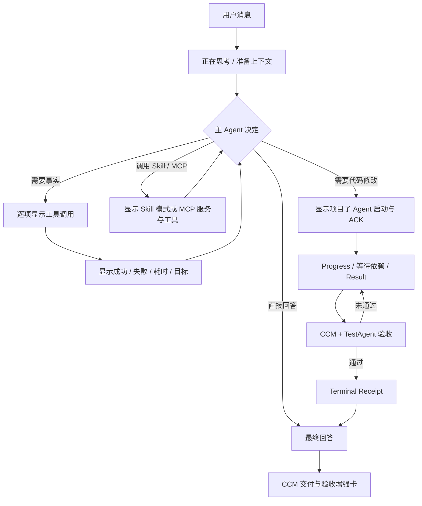

# CC 式用户可见执行流

确认日期：2026-08-09  
实现状态：全局、项目、群聊三类主 Agent 已统一接入

## 实际页面流程

默认视图采用 CC 普通模式的信息顺序：思考状态、工具行、子 Agent 行、权限或澄清、最终回答。执行完成后折叠为一行摘要；点击“展开执行记录”或按 `Ctrl+O` 查看安全参数、结果投影、文件变化、Evidence、验证与 usage。

## 统一事件协议

用户可见投影写 `ccm-user-visible-agent-event-v1`。事件绑定 `scope + scopeId + exactSessionId + generation`，工具事件附带 `toolCallId`，子 Agent 事件继续绑定 `taskId + workItemId`。统一查询和实时接口为：

- `GET /api/agent-execution/events`
- `GET /api/agent-execution/events/stream`

SSE 支持事件 ID、cursor、重连补发和事件去重。全局原有工具事件、项目隐藏执行账本、群聊工具循环及 Agent Communication V2 都只是投影来源；任务、通信、租约、Evidence 和 Terminal 状态仍由原权威账本决定。

三类主 Agent 的用户可见文本都进入同一实时事件通道：项目直接转发安全回复 delta；全局与群聊因为模型内部使用结构化决策 JSON，只在协议解析并提取用户回复后发布 `assistant_text_delta`，禁止把内部 JSON、reasoning 或工具参数流给页面。该事件 `sequence=0`，只发送给当前 SSE 订阅者，不进入磁盘回放。

群聊自动压缩只有在 SQLite/文件事务、Boundary 和恢复清单全部提交成功后，才写入 `context_compacted` 投影。投影记录 Boundary checksum、恢复 token 和原因，不保存摘要正文；展示投影失败也不得反向改变已经提交的压缩状态。

## 工具与 Agent 展示

- Read、Search、Definition、References、Implementations、Type Definition、Incoming/Outgoing Calls 和 Diagnostics 使用稳定的人类可读名称。
- MCP 显示服务与工具；Skill 显示 `inline` 或 `fork` 执行语义。
- 第三方 Agent 显示排队、启动、ACK、执行、等待依赖、Result 待验收和 CCM Terminal。
- Worker Result 只能显示“等待验收”；只有 Terminal Gate 通过后才能显示“任务已完成”。
- Provider 原生工具与 JSON 工具循环使用同一调用指纹，不得重复执行或重复显示。

## 可见性与安全

实时文本增量只经 SSE 传输，不写入事件投影；最终助手文本继续由会话消息存储。事件持久化禁止包含系统 Prompt、Worker Handoff Prompt、密钥、隐藏思维链、原生 session ID、知识/共享文件/网页/Notebook正文和工具原始大输出。上述内容只保存安全摘要、引用与 checksum，查看权威正文时重新读取当前来源。

原始思维链不展示；普通页面只显示“正在思考”和耗时。历史 `executionMessages`、`workEvents` 和 `streamEvents` 由前端兼容适配，不自动迁移。关闭 `ccStyleExecutionDisplayEnabled` 后恢复原页面展示。

## 验证

- `npm run test:cc-execution-display`
- `npm run test:cc-execution-display:e2e`
- `npm run test:cc-execution-display:visual`
- `npm run check`
- `npm run build:frontend`

专项自测验证密钥与正文哨兵不进入投影、事件幂等、三作用域实时增量不落盘、群聊压缩提交后投影，以及三类页面共用同一执行流组件。

业务链 E2E 使用真实 Communication V2 账本验证：`Find definition → Worker Dispatch/ACK/Result → CCM Terminal → TestAgent Terminal → 最终交付`。其中 Worker Result 必须显示“等待 CCM 验收”，最终交付必须晚于独立验收 Terminal。

视觉回归使用生产 Vue 组件，覆盖桌面折叠、桌面展开、`Ctrl+O` 和 390×844 移动端；验证无横向溢出、移动端隐藏键盘提示且敏感 Handoff 内容不可见。截图输出到 `scratch/cc-execution-display-render/`，不作为产品持久数据。自动化测试不调用付费 Provider。
