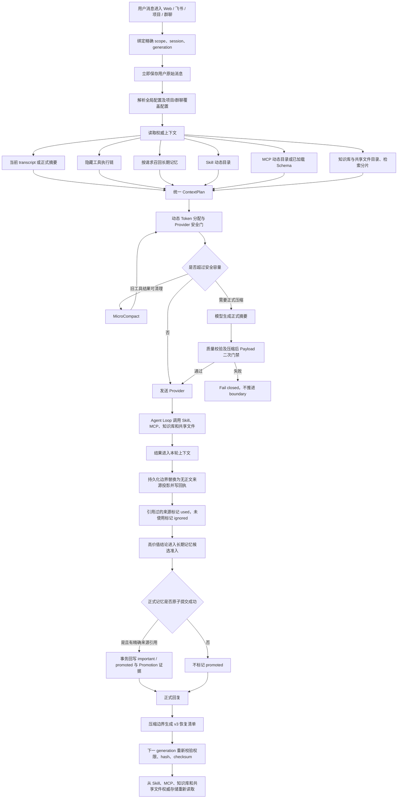
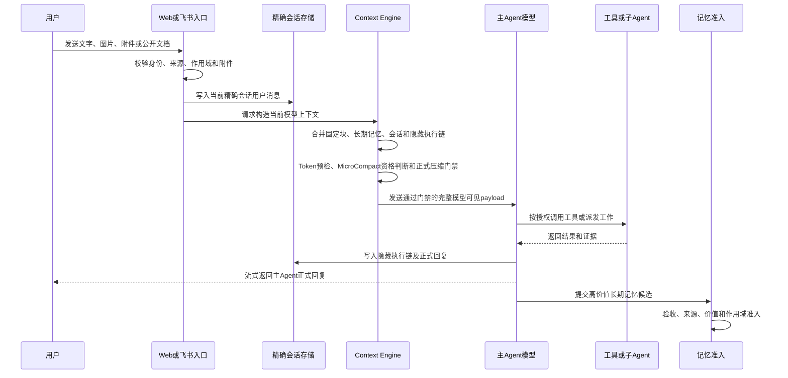
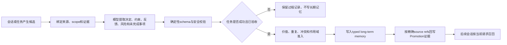

# CCM 记忆系统完整业务流程

首次确认日期：2026-07-28<br>
最近审计更新：2026-08-08<br>
实现状态：核心闭环及来源连续性收口已完成；动态 Skill/MCP、Provider MicroCompact、usage 校准 v2、知识/共享文件持久化无正文化、正式记忆准入后的 Promotion 回写，以及显式历史维护均已落地。

## 业务目标

本文确认 CCM 从用户发送消息开始，到消息持久化、模型上下文构造、动态 Skill/MCP 加载、知识库与共享文件 hydration、工具执行、Token门禁、MicroCompact、正式模型压缩、压缩后权威恢复、长期记忆写入、第三方Agent读取、缓存复用、页面展示和会话删除的完整业务流程。

记忆系统遵守五条根本边界：

1. 原始 transcript、正式模型摘要和通过准入的长期记忆是事实来源。
2. 会话连续性始终绑定一个精确会话，不把整个群聊、项目或全局助手混成一个上下文。
3. 压缩只改变模型下一轮读取的投影，不删除原始消息和原始执行证据。
4. 缓存只复用上下文准备或Provider前缀，不缓存模型最终回答，也不成为第二套记忆数据库。
5. Skill、MCP、知识库和共享文件继续由各自注册中心或业务存储保存完整定义与正文；连续性账本和压缩恢复清单只保存身份、定位、版本、checksum、Token和状态，不保存正文。

## 参与角色和精确作用域

| 入口 | 精确会话身份 | 可读取的长期记忆 | 禁止读取 |
| --- | --- | --- | --- |
| 全局Agent Web/飞书 | 当前全局 `sessionId` | 全局长期记忆 | 群聊、项目及兄弟全局会话原文 |
| 群聊主Agent | `groupId + gcs_*` | 当前群聊长期记忆 | 其他群聊和兄弟 `gcs_*` 原文 |
| 项目主Agent | `projectId + projectSessionId` | 当前项目长期记忆 | 群聊、全局、其他项目和兄弟项目会话原文 |
| 群聊项目子Agent | `groupId + gcs_* + taskId + tas_* + native generation + projectId` | 与任务相关的群聊长期记忆和目标项目长期记忆 | 兄弟会话、非目标项目和未授权记忆 |
| TestAgent | 当前任务、测试目标和验收证据 | 不进行通用长期记忆召回 | 其他任务、聊天和项目源码写权限 |
| 音乐Agent | 固定内部单例连续性，不提供用户会话列表 | 音乐偏好长期记忆 | 全局、群聊和项目记忆 |

Web和飞书只影响消息来源及回复路由，不改变记忆作用域。飞书消息进入绑定的精确飞书会话，网页消息进入网页会话；两者不会互相发送正式回复。

## 数据分类

### 1. 用户可见会话 transcript

保存：

- 用户原始消息；
- 附件、图片和公开文档的安全引用及提取结果；
- 主Agent最终采用并正式回复的内容；
- 消息ID、时间、来源和精确会话身份。

不保存为聊天气泡：

- 主Agent内部工具调用细节；
- 项目子Agent原始终端输出；
- TestAgent原始报告；
- 返工中间过程和内部协议字段。

### 2. 隐藏执行消息链

全局、群聊和项目主Agent实际采用的 `tool_use/tool_result`、源码读取、运行诊断、授权MCP调用、派发结果和验收结论按精确会话记录。它们：

- 不显示成用户聊天气泡；
- 与对应用户消息锚点绑定；
- 保持工具调用与结果配对；
- 参与Token计量、正式压缩和恢复；
- 非来源工具的原始记录不因MicroCompact或正式压缩删除；知识/共享文件读取结果在当前Loop保持完整，进入隐藏链、run/runtime、幂等和审计持久化前替换为无正文来源投影。

项目子Agent和TestAgent的完整原始过程留在任务时间线与任务回放。只有被主Agent正式采纳的结果进入父会话隐藏执行链。

### 3. 正式会话摘要

正式摘要由配置的大模型生成，用于超过上下文容量后的会话连续性。每次摘要保存：

- 摘要正文；
- 来源消息边界和消息游标；
- 上一代摘要checksum与lineage；
- 生成模型、Token计量和质量门禁结果；
- compact boundary、generation和提交回执；
- 失败、熔断和恢复状态。

本地规则摘要不能代替正式模型摘要。模型压缩失败、质量不合格或压缩后仍超限时，不提交新摘要，也不推进boundary。

### 4. 跨会话长期记忆

长期记忆只保存后续会话仍有价值的内容：

- `user`：明确长期要求和偏好；
- `feedback`：用户纠正和已确认反馈；
- `project`：验收后的项目决定、约束、契约、风险和未完成事项；
- `reference`：需要长期保留的来源与引用。

以下内容不得直接进入长期记忆：

- Skill和MCP定义；
- 临时任务状态、队列位置和进度播报；
- 未验收的子Agent输出；
- 失败、驳回或取消任务的过程结论；
- TestAgent普通过程文本；
- 可随时从源码、配置或日志重新读取的事实；
- 无来源、无证据或作用域不明的候选。

### 5. 可恢复上下文来源

知识库、全局/项目/群聊共享文件属于可恢复的权威上下文来源，不是第三层长期记忆。来源正文或知识分片被检索、自动投影或工具读取后先进入当前 Agent Loop；来源连续性账本只保存无正文回执：

- `sourceKind: knowledge | shared_file`、scope、scopeId、精确session和generation；
- source/document/chunk定位、章节、revision、checksum；
- 知识索引generation、scope checksum和query checksum；
- Token、读取/注入时间及`discovered | read | injected | used | ignored | promoted | restored`状态；
- 截断、漂移、权限撤销、删除和无法重新定位等结果；
- `contentStored: false`。

新写来源账本使用`ccm-context-source-read-receipt-v2`与`ccm-context-source-continuity-store-v2`。正式记忆准入回写的`promotionEvidence[]`只保存memory kind、memory ID、admission checksum、source ref checksum和时间，不保存长期记忆正文。

同一版本、checksum和分片组合在一个精确连续性身份内去重。普通用户在管理页面查看文件不会写入Agent来源连续性；只有上下文构建、Agent工具调用或签名内部MCP读取才写回执。

压缩后不从连续性账本恢复旧正文，而是先重新验证当前scope、权限、revision、checksum、知识索引generation和分片定位，再从知识库或共享文件权威存储读取当前版本。发生漂移时使用当前内容并记录`drift`；权限撤销、来源删除或无法定位时跳过并记录原因。

### 6. 固定模型上下文

System、Rules、实际载入的Skill/MCP定义、子Agent目录和本轮任务状态属于模型上下文块。授权可用但未进入当前Provider载荷的Skill/MCP只保留在可用目录中，不计入本轮Token，也不会被伪装成已加载；这些内容都不是跨会话长期记忆。

Skill/MCP的处理规则：

- 授权清单先形成可用目录，只有真实放入当前Provider载荷的目录、Schema或Skill正文才标记为`loaded`并计Token；
- 大模型决定当前任务实际选择哪些Skill和MCP；
- 实际工具调用和结果进入当前会话隐藏执行链，并按精确名称标记为`invoked`；
- 每个项目分别保存`available | loaded | invoked | unavailable`状态、内容或Schema checksum及调用结果checksum；旧会话没有逐项回执时显示“本轮状态未证明”，禁止按整个分类Token反推；
- 正式压缩可以总结工具执行形成的决定和证据；
- Skill/MCP定义本身不会被复制进长期记忆或反复写进会话摘要。

正式压缩提交时会同时生成共享 `MainAgentPostCompactRestoreManifestV3`，但清单与长期记忆、摘要正文彼此独立：

- 已实际调用的Skill保存调用证据和内容checksum，压缩后新Run重新读取当前正文并校验后恢复；
- 通过`tool_search`实际加载的MCP保存Schema checksum，压缩后在授权、连接和目录revision仍一致时恢复到`loadedToolNames`；
- 未调用Skill、未加载的延迟MCP不进入恢复内容；可信`alwaysLoad`由当前目录自然加载；
- MCP恢复项加入完整Provider payload后重新执行Token门禁，超限项退回延迟加载；超长Skill正文按统一预算保留首尾和明确截断标记，不整项静默丢弃；
- Skill内容变化、MCP Schema变化、授权撤销、连接断开或作用域不匹配均失败关闭，不使用旧内容；
- 来源恢复引用独立的无正文来源manifest checksum；正文从当前知识库或共享文件存储权威重读；
- 清单只保存身份、checksum、Token和证据ID，正文继续来自当前Skill/MCP目录或来源权威存储；来源工具的持久执行结果只保留`ccm-context-source-tool-result-reference-v1`，不以隐藏执行链作为正文副本。

因此，压缩后的同一精确会话可以继续使用此前已经实际选择的Skill和MCP状态，但新会话、兄弟会话、清空或归档会话不会继承。群聊旧`ccm-post-compact-reinjection-v1`保持只读兼容，新压缩统一写入共享清单。

### 7. 动态上下文策略

全局、项目和群聊三类主Agent共用 `MainAgentContextPolicy`。全局Agent使用全局配置；项目主Agent使用“项目覆盖 > 全局”；群聊主Agent使用“群覆盖 > 全局”。项目/群字段省略表示保持原值，`null`表示清除覆盖并继承全局；接口接受camelCase和snake_case，统一返回camelCase。

默认预算和加载模式：

| 项目 | 默认值 | 作用 |
| --- | ---: | --- |
| MCP加载模式 | `deferred` | 首轮只投影可发现名称，搜索命中后加载完整功能和参数Schema |
| MCP auto阈值 | 上下文窗口的10% | 可选定义总量未超过阈值时inline，否则整体deferred |
| Skill目录 | 上下文窗口的1% | 保留所有已授权名称，简介按最近调用、内置、名称排序填充 |
| 单条Skill恢复 | 5,000 Token | 压缩后单个已调用Skill正文上限 |
| Skill恢复总量 | 25,000 Token | 压缩后所有Skill正文联合上限 |
| 来源目录 | 上下文窗口的1% | 知识库与共享文件名称、类型、说明、版本等无正文目录 |
| 来源正文hydration | 上下文窗口的10% | 本轮知识分片与共享文件正文联合目标预算 |
| 单来源恢复 | 5,000 Token | 压缩后单个知识/共享文件来源上限 |
| 来源恢复总量 | 25,000 Token | 压缩后所有来源联合上限 |

上述值都是目标或配置上限，不是绕过Provider安全门的保留容量。最终预算必须先扣除System、摘要、当前请求、MCP Schema、Skill恢复、输出预留和安全缓冲。名称保留、`alwaysLoad`、当前已加载项和压缩恢复项也不能越过Provider上限；容量不足时必须降级deferred或fail closed。

### 8. 缓存和审计元数据

Context Engine状态只保存块ID、类型、Token、checksum、不可变地址、编辑计划、能力证据、usage和耗时。磁盘状态不保存Prompt正文、API Key、完整工具结果或模型最终回答。

## 从用户消息到模型回复

### 当前实际工作流程



流程图表达当前全局、项目和群聊主Agent的共同主链。音乐Agent继续使用其单例会话、正式摘要和长期音乐偏好流程，不接入开发知识库与本次新增的知识/共享文件来源连续性。

### 参与方调用时序



### 第一步：入口接收和精确绑定

1. Web、飞书、任务派发和工作台先解析当前用户、消息来源和目标scope。
2. 群聊必须绑定当前 `groupId + gcs_*`；项目必须绑定 `projectId + projectSessionId`；全局必须绑定当前全局会话。
3. 图片、附件和公开在线文档先进入统一资料接入链，保留来源、checksum和提取状态。
4. 入口校验成功后，用户消息立即写入当前精确 transcript，不等待模型成功才保存。
5. 普通问答和业务任务都保留用户消息；是否创建任务由模型语义决定，不影响会话落盘。

### 第二步：读取权威数据

Context Engine从事实来源读取：

1. 当前精确会话的原始消息或正式摘要链；
2. 当前精确会话隐藏执行消息；
3. 当前scope召回出的长期记忆；
4. 本轮用户消息、附件和恢复上下文；
5. 当前System、Rules、授权Skill、MCP定义和任务状态；
6. 当前scope允许读取的知识库与全局/项目/群聊共享文件目录；
7. 本轮相关检索、显式引用、自动共享文件投影和压缩后权威重读得到的正文分片。

任何兄弟会话、其他项目或其他群聊的数据都不能因名称相似被读取。scope、session、generation、boundary或checksum不一致时停止增量复用并重新完整读取。

### 第三步：统一上下文投影

全局、群聊、项目和音乐Agent共用统一的上下文投影规则：

- **未压缩**：读取当前精确会话从起点到当前请求前的全部完整轮次。
- **已压缩**：读取最新正式摘要、动态近期完整原文、boundary后新增消息和需要恢复的工具证据。
- 完整轮次包含用户消息、assistant response及成对的tool-use/tool-result。
- 不使用固定消息条数、12K/24K字符截断或本地摘要绕过容量门禁。
- 图片和二进制内容在模型压缩投影中使用安全标记，原始附件仍由权威存储保存。
- 知识库和共享文件正文按当前请求、使用状态、最近读取和稳定顺序进入动态hydration预算；超限内容降级为deferred，不再使用固定32K共享文件投影。
- 同一来源分片在一个Run内只注入和计量一次；来源目录、读取回执和恢复manifest不保存正文。

Context Engine V2将payload划分为不可变块：

```text
System
Rules
Skills
MCP definitions
Context source catalog
Knowledge/shared-file hydration
Long-term memory
Canonical summary / recovery
Conversation turns
Tool use / tool result
Current request
```

每个块计算真实Token估算、checksum、保护状态和稳定性，但持久状态不保存正文。

### 第四步：Token容量门禁

模型调用前计算：

- 完整模型可见输入Token；
- 当前模型上下文窗口；
- 预留输出Token；
- Provider usage校准v2；
- 第三方Agent必需hydration Token；
- Skill/MCP/来源目录与压缩恢复Token；
- 知识库与共享文件正文hydration Token；
- Hooks、恢复附件、安全缓冲和本轮请求Token。

Provider usage校准按endpoint、协议、Provider family、model、backend和估算器版本隔离。成功的流式和非流式调用采集`direct input + cache creation + cache read`；失败或缺少usage的调用不参与学习。每个身份最多保留64个无正文样本，EWMA系数为0.25；8个样本后使用median/MAD排除异常值，同时计算p95比例与p95正向Token漂移。30天未更新停止用于门限，90天后清理。最终安全估算取原始估算、EWMA、p95比例和p95正向漂移的最大值，因此校准不能降低原始安全门限。

门禁结果：

- 容量充足：发送完整payload。
- 旧工具结果符合MicroCompact条件：只调整本轮模型投影，然后重新计量。
- 达到正式压缩门限：先执行模型压缩，提交成功后重建完整payload并再次Token门禁。
- 仍然超限、压缩失败或无法证明容量：fail closed，不靠字符裁剪继续请求。

## MicroCompact流程

MicroCompact只处理已经配对、足够旧且不属于近期工作集的工具结果。它不是看到长结果就立即截断。

允许条件包括：

- 工具调用和结果可以完整对应；
- 结果已经离开近期保护窗口；
- 达到配置的空闲时间、缓存生命周期或经过验证的原生编辑条件；
- 清理不会破坏当前任务需要的证据和工具调用结构。

处理结果：

- 模型投影中的旧工具正文替换为可恢复标记或Provider原生缓存引用；
- 原始隐藏执行账本、任务回放、工具证据和附件不修改；
- 记录选择原因、清理数量、保留数量、节省Token、checksum和执行时间；
- 普通Provider遇到上下文压力仍进入正式模型压缩，不能用MicroCompact绕过。

Provider原生MicroCompact与Prompt Cache是两种不同能力：

- 官方Anthropic端点可使用原生`context_management`；兼容端必须通过“测试连接”触发的无业务内容能力探测，证明有效期为7天；
- Prompt Cache能力证据不能直接证明`context_management`或MicroCompact可用；
- 流式与非流式请求统一携带经过验证的原生字段和beta header；
- 只有Provider响应中存在可核验的`context_management.applied_edits`，才记录`native_applied`并扣减会话容量；仅字段被接受、仅返回请求ID或延迟下降都不算原生应用；
- 兼容端在输出开始前明确拒绝原生字段时，标记`unsupported`并以CCM controlled projection重试一次；已经产生输出时不重试，避免重复回答；
- OpenAI Prompt Cache和Gemini implicit/explicit cache继续作为缓存能力，不标记为MicroCompact。

## 正式模型压缩流程

```text
当前权威摘要 Sn + boundary后完整轮次 + 符合条件的执行证据
-> 压缩模型生成候选摘要 Sn+1
-> 结构、事实锚点、来源、质量和可恢复性校验
-> 用候选摘要重建真实业务payload
-> 第二次Token容量门禁
-> 原子提交摘要、lineage、boundary和回执
```

首次压缩形成 `S1`；后续压缩使用上一代正式摘要与新增内容形成 `S2`、`S3`。新摘要必须保留仍然有效的用户要求、决定、约束、风险和未完成事项。

压缩前创建精确会话恢复点。Prompt Too Long恢复按完整assistant/API回合从旧到新处理，不拆分工具调用与结果。压缩候选只有在质量门禁和压缩后真实payload门禁均通过后才能提交。

正式压缩提交时同时写入共享v3恢复清单。来源恢复候选按“当前请求再次明确引用、已经提升的重要来源、实际使用来源、最近注入来源”排序；单来源默认最多5K、合计最多25K，并同时受10%来源hydration目标与剩余安全容量约束。恢复前必须重新验证权限和当前版本，正文只进入重建后的当前Provider payload，来源恢复回执保持`contentStored: false`。

压缩不会执行：

- 删除原始transcript；
- 删除原始工具账本；
- 修改长期记忆；
- 将失败过程自动提升为事实；
- 将其他会话内容合并进当前摘要。

## 主Agent和子Agent写入规则

### 全局Agent

- 用户消息和全局Agent正式回复写入当前全局会话。
- 全局工具、群聊派发和采用的下游结果进入当前会话隐藏执行链。
- 下游群聊的完整过程不复制回全局聊天；只保留全局Agent采纳的状态和最终结论。
- 全局长期记忆只接收跨全局会话仍有效的用户要求、反馈和全局决定。

### 群聊主Agent

- 用户消息和群聊主Agent正式回复写入当前 `gcs_*`。
- 项目子Agent原始输出进入任务时间线，不直接写聊天正文。
- 主Agent采用的派发、权限、验收、合并和最终结论进入当前会话隐藏执行链。
- 只有主Agent验收通过的高价值结论才成为群聊长期记忆候选。

### 项目主Agent

- 用户消息和项目主Agent正式回复写入当前项目会话。
- 开发Agent原始回复、终端输出、TestAgent报告和返工过程进入任务回放。
- 项目主Agent采用的源码分析、派发和验收结论进入当前项目会话隐藏执行链。
- 任务成功且通过验收后，决定、约束、风险和未完成事项才可成为项目长期记忆候选。

### 项目子Agent

- 子Agent使用独立 `tas_*` 和Provider native session/generation持续执行工作。
- 未完成任务的返工优先复用同一个原生会话；无法证明续跑时创建新generation并重新hydration。
- 取消后重新创建的新任务默认建立新的任务Agent会话，不复用已关闭任务的会话身份。
- 原始输出不直接写父聊天或长期记忆；结构化回执交给主Agent验收。

### TestAgent

- 读取用户目标、验收标准、真实变更、命令证据、浏览器证据和项目测试目标。
- 报告进入任务时间线，不直接污染会话正文。
- TestAgent不能写业务代码，也不能直接写长期记忆。
- 只有主Agent采用的验收结论进入父会话执行链。

### 知识库与共享文件使用判定

- 来源被最终回答中的citation、文件ID、分片ID或后续工具参数引用时标记为`used`；
- 本轮已经注入但结束时没有被引用的来源标记为`ignored`，这不删除来源，也不表示来源质量有问题；
- 项目 durable-memory 或群聊 typed-memory 原子提交成功且候选包含精确结构化来源引用后，统一事务入口才把对应回执标记`important/promoted`；
- Promotion按`memoryId + sourceRefChecksum`幂等，回写失败不回滚已经提交的正式记忆，但记录可重试审计；准入拒绝、未验收、写入失败、撤销或跨session引用不提升；
- 不额外调用付费模型判断来源重要性；
- 压缩摘要或长期记忆只保存结论、必要引用和来源定位，不应复制知识文档或共享文件原始正文；
- 第三方Agent通过签名内部MCP搜索或读取知识/共享文件时，也写入绑定精确session/generation的同类无正文回执。

## 长期记忆准入流程



长期记忆写入必须同时满足：

1. 有精确来源会话或任务证据；
2. 内容属于允许的长期记忆类型；
3. 任务型内容已经由主Agent验收；
4. 不含密钥、临时状态和未验证声明；
5. 与现有记忆的重复、冲突和替代关系已经处理；
6. 写入目标与候选scope完全一致。

`report_memory_usage`只能报告使用、忽略、冲突和候选记忆，不能直接修改正式长期记忆。

## 第三方Agent记忆MCP

Codex、Claude Code、Cursor、Antigravity CLI、OpenCode等支持MCP的开发Agent使用签名只读快照读取记忆。

快照包含：

- 精确scope、session、task/native session和generation；
- compact boundary、消息游标、snapshot checksum和ContextPlan checksum；
- 当前工作单和验收标准；
- 未压缩完整历史，或已压缩正式摘要加动态近期原文；
- 相关群聊/项目长期记忆；
- 本轮授权的MCP、Skill和共享文件清单。

读取规则：

- 首次绑定、新generation、Provider切换或boundary变化：完整hydration。
- 同generation且上一轮确认有效：只读取游标后的新增消息和变化记忆。
- challenge、snapshot、checksum、scope或游标不匹配：拒绝确认并设置 `rehydration_required`。
- 必需分段或必需记忆未读完：`acknowledge_memory_context`失败。
- 修改任务缺少有效确认：不提交任务回执和长期记忆；只读问答才允许完整Prompt降级。
- `search_knowledge`、`read_knowledge_document`和共享文件读取仍从权威存储返回当前内容，同时写入精确session/generation的无正文来源回执。

MCP快照只是可重新生成的派发缓存，不是记忆权威存储，也不能直接写canonical memory。

## Context Engine缓存流程

### CCM自建缓存

Provider不支持原生缓存或无法证明时仍可使用：

1. **上下文物化热缓存**：短期在内存复用已构造的消息结构和Token预检。
2. **Singleflight**：相同scope、session、generation和内容checksum的并发请求只物化一次，模型回答仍相互独立。
3. **自适应稳定前缀**：System、Rules及稳定Skill/MCP块靠前，任务状态和近期消息靠后；不改变会话和工具顺序。
4. **成本与延迟闭环**：统计投影、Provider耗时、直接输入、缓存创建/读取和成本，不调用模型生成建议。
5. **受控清理**：删除会话、generation/boundary变化、长期未命中和过期证据会清理对应状态。
6. **多实例共享**：共享数据目录中的进程使用文件锁、可回收租约和统一能力证据；Prompt正文不落盘共享。

### Provider原生缓存

- OpenAI：稳定 `prompt_cache_key`、可选保留时间及真实cached token usage。
- Anthropic：Prompt Cache与`context_management`分别验证；能力成立时使用`cache_control`，只有独立MicroCompact证明成立时才使用经过校验的`context_management/cache_reference/cache_edits`。
- Gemini：Generate Content稳定前缀和原生缓存usage。
- 中转站：只有两轮稳定前缀测试返回真实缓存Token才标记 `confirmed`。
- vLLM/SGLang：CCM只连接外部服务；只有每请求Token证据可以计入节省。

原生缓存不可用、未证明或临时降级时自动回到CCM受控投影，不影响正式摘要和长期记忆。

## 数据写入矩阵

| 数据 | 写入时机 | 保存位置/范围 | 是否进入模型 | 是否进入长期记忆 |
| --- | --- | --- | --- | --- |
| 用户消息 | 入口校验后立即 | 当前精确transcript | 是 | 仅高价值内容经准入后 |
| 主Agent正式回复 | 正式回复确定后 | 当前精确transcript | 是 | 仅验收后的高价值结论 |
| 主Agent工具调用/结果 | 工具真实执行后 | 当前精确隐藏执行链 | 是，允许选择性MicroCompact | 仅被采纳的长期结论经准入后 |
| 子Agent原始输出 | 子Agent执行过程中 | 任务时间线/回放 | 不直接进入父聊天 | 否 |
| TestAgent报告 | 每轮验收后 | 任务时间线/回放 | 主Agent按需读取 | 否 |
| 主Agent采用的验收结论 | 主Agent复盘后 | 父会话隐藏执行链 | 是 | 通过准入后可以 |
| 正式会话摘要 | 模型压缩和双门禁通过后 | 当前精确会话摘要链 | 是 | 否 |
| 动态近期原文 | 每次投影动态选择 | 从原始transcript读取 | 是 | 否 |
| Skill/MCP目录 | 每轮按授权和动态预算构造 | 注册中心与ContextPlan元数据 | 只有实际目录内容计Token | 否 |
| 已加载Skill/MCP定义 | 调用、搜索命中、alwaysLoad或压缩恢复后 | 当前Provider payload；定义正文仍在注册中心 | 是并计Token | 否 |
| 知识/共享文件正文 | 相关检索、显式读取、自动投影或压缩恢复时 | 权威知识库/共享文件存储；只在当前Agent Loop保留完整值 | 是并计Token | 否；持久化边界统一替换为无正文来源引用 |
| 上下文来源读取回执 | 来源被发现、读取、注入、使用、忽略、提升或恢复时 | 精确session/generation的v2来源连续性账本 | 只作为恢复与审计元数据 | 否，`contentStored: false`；Promotion只存无正文证据 |
| v3压缩恢复清单 | 正式压缩提交时 | 精确主Agent连续性清单 | 下一generation用于重新校验和权威重读 | 否，`contentStored: false` |
| 长期记忆候选 | 成功回执或会话提取后 | 候选/审计 | 准入前不作为正式记忆 | 待准入 |
| 正式长期记忆 | admission通过后 | 精确全局/群聊/项目typed memory | 按任务召回 | 已是长期记忆 |
| ContextPlan/cache状态 | 每次上下文准备和usage后 | 元数据、checksum和回执 | 不作为聊天正文 | 否 |
| usage校准v2 | 成功且包含usage的Provider调用后 | endpoint/协议/family/model/backend/估算器隔离的无正文样本 | 用于下一轮安全门限 | 否 |

## 删除、归档和代际变化

- 删除会话会删除该会话连续性、工具/Skill/MCP/来源恢复状态、压缩状态和精确Context Engine缓存，不删除scope级长期记忆，也不删除知识库或共享文件权威数据。
- 归档会话保留原始消息和正式摘要，但不再作为当前活跃会话继续追加。
- native generation、Provider或compact boundary变化会关闭旧增量身份，下一轮重新完整hydration。
- CCM重启后从canonical transcript、正式摘要、执行账本和持久回执恢复；内存热缓存可以丢失且可安全重建。
- 过期Provider证据、旧状态和长期未访问计划由受控维护清理，保留审计摘要。

## 用户可见展示

会话上下文和记忆中心使用真实数据展示：

- System、Rules、Skill、MCP、长期记忆、会话、工具、恢复和当前请求的Token占比；
- MCP与Skill逐项展示“可用、已加载、已调用、不可用”；授权但未加载的条目不计入本轮百分比；
- 当前是否未压缩、正式摘要来源、近期原文和距离压缩门限；
- MicroCompact触发原因、清理量、保留量和原始数据保留状态；
- Context Engine块复用、热缓存来源、稳定前缀、投影耗时和Provider耗时；
- 直接输入、缓存创建、缓存读取、命中率、成本和配置建议；
- 来源目录、知识库、共享文件、来源恢复和安全余量的Token分配；
- 来源`discovered/read/injected/used/ignored/promoted/restored`数量、版本、漂移、截断及容量/权限/删除跳过原因；
- 历史数据缺少分类或回执时显示“历史未记录”，不生成虚假统计。

Prompt正文、API Key、完整工具结果、Provider内部session和排障协议默认不显示。

## 失败和安全策略

- 精确scope/session不匹配：拒绝读取或写入。
- Token超限：先正式模型压缩，失败则停止业务模型调用。
- 模型摘要失败或质量不足：保留旧摘要和boundary，不提交候选。
- 工具调用与结果不完整：禁止MicroCompact和摘要提交破坏配对。
- Provider原生缓存未证明：使用CCM受控投影，不宣称原生命中。
- MCP确认不完整：修改任务fail closed，不提交正式回执和长期记忆。
- 来源权限、scope、session或generation不匹配：不读取正文；来源恢复失败只记录无正文原因，不使用旧内容绕过。
- 来源目录或hydration预算不足：降级deferred，不越过输出预留和安全缓冲。
- 子Agent或TestAgent退出码为0但证据不足：任务不能标记完成。
- 长期记忆候选冲突、无来源或未验收：拒绝写入正式记忆。
- 删除、维护和多实例更新使用原子写入与文件锁，避免并发覆盖。

## 实现入口

- `backend/system/session-model-context.ts`
- `backend/system/provider-neutral-context-cache.ts`
- `backend/system/context-engine-observability.ts`
- `backend/system/session-execution-ledger.ts`
- `backend/system/session-memory-window.ts`
- `backend/tools/main-agent-context-policy.ts`
- `backend/tools/main-agent-tool-runtime.ts`
- `backend/system/main-agent-post-compact-continuity.ts`
- `backend/system/main-agent-context-source-continuity.ts`
- `backend/system/model-token-preflight.ts`
- `backend/system/provider-native-microcompact-capability.ts`
- `backend/modules/collaboration/group-session-model-context.ts`
- `backend/modules/collaboration/group-memory-compaction.ts`
- `backend/modules/collaboration/collaboration-runtime-plan-tools.ts`
- `backend/modules/collaboration/provider-native-compact-execution-receipt.ts`
- `backend/modules/projects/project-session-compaction.ts`
- `backend/modules/projects/project-main-agent.ts`
- `backend/agents/global/memory.ts`
- `backend/modules/global/global-agent-agentic-runtime.ts`
- `backend/integrations/third-party-memory-snapshot.ts`
- `backend/integrations/knowledge-context-mcp.ts`
- `backend/modules/knowledge/knowledge-access.ts`
- `backend/modules/tools/shared-files-v2.ts`
- `backend/modules/knowledge/memory-control-center-api.ts`
- `frontend/src/components/knowledge/MemoryCenterPanel.vue`
- `frontend/src/components/common/ContextPolicyFields.vue`

## 已完成的来源收口与历史维护

2026-08-08源码对照审计发现的两个待收口项已经关闭：

1. `query_knowledge`、`search_knowledge`、`read_knowledge_document`、`read_shared_files`、`read_global_shared_files`及内部MCP等价调用，在模型当前Loop中仍使用完整结果；进入全局/项目隐藏执行链、全局run/runtime、`global-agent-tool`幂等结果和受控审计边界前，统一替换为`ccm-context-source-tool-result-reference-v1`。非来源工具保持原行为。
2. 项目durable-memory与群聊typed-memory仅在正式准入并原子提交成功后调用`promoteContextSourceReceipts`；`used`不再被全局final report等宽松信号直接升级为`promoted`。

历史数据不会在启动时自动改写。管理员在记忆中心“历史来源收口”面板按精确scope/session执行：

```text
预览 -> 返回数量、ID、checksum、预计移除Token和未确认项
-> 管理员填写原因并二次确认
-> 服务端核对planChecksum与所有源文件/幂等记录checksum
-> 创建受限备份并原子替换可证明的来源正文副本
-> 对具有精确session及结构化source refs的正式记忆幂等补齐Promotion
-> 必要时按job ID回滚备份
```

历史中无法证明属于来源读取的普通工具数据标记为`unresolved`并跳过；维护接口和manifest不返回正文，备份只用于同一维护任务回滚，不删除知识库、共享文件、正式长期记忆或用户可见聊天。

## 验证证据

- Context Engine V2专项 `55` 项通过。
- 全会话CC压缩对齐 `51` 项通过。
- 第三方记忆MCP hydration `49` 项通过。
- 记忆领域回归 `27/27` 通过。
- 知识领域回归 `6/6` 通过。
- Agent领域回归 `19/19` 通过。
- 前端领域回归 `21/21` 通过。
- 前端、飞书MCP和后端production build通过。
- 文档链接 `1181` 个，失败 `0`。
- 所有Provider测试使用mock，付费Provider调用为 `0`。
- 2026-08-08来源连续性专项通过：32K/200K/516K分别得到1%目录与10%hydration目标预算，来源回执`contentStored: false`，共享文件漂移后恢复当前权威版本。
- 2026-08-08动态上下文策略与usage校准专项通过：Skill名称保留、MCP deferred/auto/inline、10%临界值、范围/继承/null清除、v2无正文样本、MAD异常排除和“校准不低于原始估算”均通过。
- 2026-08-08压缩连续性专项通过：新写`ccm-main-agent-post-compact-restore-manifest-v3`，Skill与MCP正常恢复，内容或Schema变化时拒绝旧项并记录漂移原因。
- 2026-08-08来源无正文化与Promotion闭环专项通过：当前Loop保留正文可用性，执行链、run/runtime、幂等结果、来源账本与维护API仅持久化无正文投影；正式记忆提交后精确Promotion、错误checksum拒绝、显式迁移与rollback均通过。
- 2026-08-08来源持久化与Promotion专项通过：正文哨兵不进入来源投影、v2回执或维护响应；Promotion精确匹配且重复提交幂等，历史维护支持checksum拒绝、备份与回滚。

## 最终确认

CCM当前记忆系统的核心链路已经形成闭环：

```text
用户消息
-> 精确会话原始存储
-> 解析全局与项目/群聊覆盖策略
-> 固定上下文、长期记忆、会话、执行链、动态Skill/MCP目录和来源目录统一投影
-> 知识库/共享文件按联合动态预算检索或hydration
-> usage校准v2参与真实Token安全门
-> 选择性MicroCompact或正式模型压缩
-> 主Agent/子Agent/TestAgent执行与验收
-> 正式回复、无正文来源工具投影和v2来源回执写回
-> 高价值候选经过准入原子写入长期记忆，并按精确source refs回写Promotion证据
-> 后续精确会话按需召回
-> 压缩后按v3清单重新校验Skill、MCP和来源并从权威存储恢复
-> 第三方Agent通过签名MCP完整或增量hydration
-> 缓存、usage、页面展示和受控清理
```

精确会话、正式摘要、长期记忆、Token门禁、缓存和受控清理流程适用于当前全局、群聊、项目、项目子Agent和音乐Agent记忆链；动态Skill/MCP与知识/共享文件来源连续性适用于全局、项目和群聊三类主Agent，第三方开发Agent通过签名MCP接入，音乐Agent不读取开发知识库。任何未来实现不得以本地字符截断、跨scope查询、未验收写回、伪造缓存命中或删除原始事实来源的方式绕过上述边界。

发布说明必须继续区分`used`与已经通过正式长期记忆准入的`promoted`，并明确“当前Loop可用完整来源正文”不等于“CCM持久执行链保存正文副本”。
