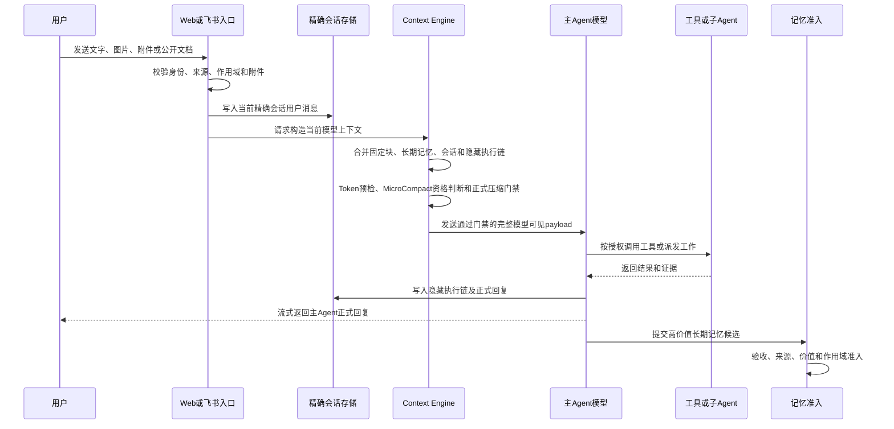
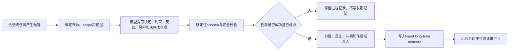

# CCM 记忆系统完整业务流程

确认日期：2026-07-28  
实现状态：已完成并通过记忆、Agent、前端和生产构建回归

## 业务目标

本文确认 CCM 从用户发送消息开始，到消息持久化、模型上下文构造、工具执行、Token门禁、MicroCompact、正式模型压缩、长期记忆写入、第三方Agent读取、缓存复用、页面展示和会话删除的完整业务流程。

记忆系统遵守四条根本边界：

1. 原始 transcript、正式模型摘要和通过准入的长期记忆是事实来源。
2. 会话连续性始终绑定一个精确会话，不把整个群聊、项目或全局助手混成一个上下文。
3. 压缩只改变模型下一轮读取的投影，不删除原始消息和原始执行证据。
4. 缓存只复用上下文准备或Provider前缀，不缓存模型最终回答，也不成为第二套记忆数据库。

## 参与角色和精确作用域

| 入口 | 精确会话身份 | 可读取的长期记忆 | 禁止读取 |
| --- | --- | --- | --- |
| 全局Agent Web/飞书 | 当前全局 `sessionId` | 全局长期记忆 | 群聊、项目及兄弟全局会话原文 |
| 群聊主Agent | `groupId + gcs_*` | 当前群聊长期记忆 | 其他群聊和兄弟 `gcs_*` 原文 |
| 项目主Agent | `projectId + projectSessionId` | 当前项目长期记忆 | 群聊、全局、其他项目和兄弟项目会话原文 |
| 群聊项目子Agent | `groupId + gcs_* + taskId + tas_* + native generation + projectId` | 与任务相关的群聊长期记忆和目标项目长期记忆 | 兄弟会话、非目标项目和未授权记忆 |
| TestAgent | 当前任务、测试目标和验收证据 | 不进行通用长期记忆召回 | 其他任务、聊天和项目源码写权限 |
| 音乐Agent | 固定内部单例连续性，不提供用户会话列表 | 音乐偏好长期记忆 | 全局、群聊和项目记忆 |

Web和飞书只影响消息来源及回复路由，不改变记忆作用域。飞书消息进入绑定的精确飞书会话，网页消息进入网页会话；两者不会互相发送正式回复。

## 数据分类

### 1. 用户可见会话 transcript

保存：

- 用户原始消息；
- 附件、图片和公开文档的安全引用及提取结果；
- 主Agent最终采用并正式回复的内容；
- 消息ID、时间、来源和精确会话身份。

不保存为聊天气泡：

- 主Agent内部工具调用细节；
- 项目子Agent原始终端输出；
- TestAgent原始报告；
- 返工中间过程和内部协议字段。

### 2. 隐藏执行消息链

全局、群聊和项目主Agent实际采用的 `tool_use/tool_result`、源码读取、运行诊断、授权MCP调用、派发结果和验收结论按精确会话记录。它们：

- 不显示成用户聊天气泡；
- 与对应用户消息锚点绑定；
- 保持工具调用与结果配对；
- 参与Token计量、正式压缩和恢复；
- 原始记录不因MicroCompact或正式压缩删除。

项目子Agent和TestAgent的完整原始过程留在任务时间线与任务回放。只有被主Agent正式采纳的结果进入父会话隐藏执行链。

### 3. 正式会话摘要

正式摘要由配置的大模型生成，用于超过上下文容量后的会话连续性。每次摘要保存：

- 摘要正文；
- 来源消息边界和消息游标；
- 上一代摘要checksum与lineage；
- 生成模型、Token计量和质量门禁结果；
- compact boundary、generation和提交回执；
- 失败、熔断和恢复状态。

本地规则摘要不能代替正式模型摘要。模型压缩失败、质量不合格或压缩后仍超限时，不提交新摘要，也不推进boundary。

### 4. 跨会话长期记忆

长期记忆只保存后续会话仍有价值的内容：

- `user`：明确长期要求和偏好；
- `feedback`：用户纠正和已确认反馈；
- `project`：验收后的项目决定、约束、契约、风险和未完成事项；
- `reference`：需要长期保留的来源与引用。

以下内容不得直接进入长期记忆：

- Skill和MCP定义；
- 临时任务状态、队列位置和进度播报；
- 未验收的子Agent输出；
- 失败、驳回或取消任务的过程结论；
- TestAgent普通过程文本；
- 可随时从源码、配置或日志重新读取的事实；
- 无来源、无证据或作用域不明的候选。

### 5. 固定模型上下文

System、Rules、当前授权Skill、MCP工具定义、子Agent目录和本轮任务状态属于模型上下文块。它们每轮按当前配置重新构造并计入真实Token，但不是跨会话长期记忆。

Skill/MCP的处理规则：

- 定义和授权清单作为独立块进入当前模型请求；
- 大模型决定当前任务实际选择哪些Skill和MCP；
- 实际工具调用和结果进入当前会话隐藏执行链；
- 正式压缩可以总结工具执行形成的决定和证据；
- Skill/MCP定义本身不会被复制进长期记忆或反复写进会话摘要。

### 6. 缓存和审计元数据

Context Engine状态只保存块ID、类型、Token、checksum、不可变地址、编辑计划、能力证据、usage和耗时。磁盘状态不保存Prompt正文、API Key、完整工具结果或模型最终回答。

## 从用户消息到模型回复



### 第一步：入口接收和精确绑定

1. Web、飞书、任务派发和工作台先解析当前用户、消息来源和目标scope。
2. 群聊必须绑定当前 `groupId + gcs_*`；项目必须绑定 `projectId + projectSessionId`；全局必须绑定当前全局会话。
3. 图片、附件和公开在线文档先进入统一资料接入链，保留来源、checksum和提取状态。
4. 入口校验成功后，用户消息立即写入当前精确 transcript，不等待模型成功才保存。
5. 普通问答和业务任务都保留用户消息；是否创建任务由模型语义决定，不影响会话落盘。

### 第二步：读取权威数据

Context Engine从事实来源读取：

1. 当前精确会话的原始消息或正式摘要链；
2. 当前精确会话隐藏执行消息；
3. 当前scope召回出的长期记忆；
4. 本轮用户消息、附件和恢复上下文；
5. 当前System、Rules、授权Skill、MCP定义和任务状态。

任何兄弟会话、其他项目或其他群聊的数据都不能因名称相似被读取。scope、session、generation、boundary或checksum不一致时停止增量复用并重新完整读取。

### 第三步：统一上下文投影

全局、群聊、项目和音乐Agent共用统一的上下文投影规则：

- **未压缩**：读取当前精确会话从起点到当前请求前的全部完整轮次。
- **已压缩**：读取最新正式摘要、动态近期完整原文、boundary后新增消息和需要恢复的工具证据。
- 完整轮次包含用户消息、assistant response及成对的tool-use/tool-result。
- 不使用固定消息条数、12K/24K字符截断或本地摘要绕过容量门禁。
- 图片和二进制内容在模型压缩投影中使用安全标记，原始附件仍由权威存储保存。

Context Engine V2将payload划分为不可变块：

```text
System
Rules
Skills
MCP definitions
Long-term memory
Canonical summary / recovery
Conversation turns
Tool use / tool result
Current request
```

每个块计算真实Token估算、checksum、保护状态和稳定性，但持久状态不保存正文。

### 第四步：Token容量门禁

模型调用前计算：

- 完整模型可见输入Token；
- 当前模型上下文窗口；
- 预留输出Token；
- Provider usage校准；
- 第三方Agent必需hydration Token；
- Hooks、恢复附件和本轮请求Token。

门禁结果：

- 容量充足：发送完整payload。
- 旧工具结果符合MicroCompact条件：只调整本轮模型投影，然后重新计量。
- 达到正式压缩门限：先执行模型压缩，提交成功后重建完整payload并再次Token门禁。
- 仍然超限、压缩失败或无法证明容量：fail closed，不靠字符裁剪继续请求。

## MicroCompact流程

MicroCompact只处理已经配对、足够旧且不属于近期工作集的工具结果。它不是看到长结果就立即截断。

允许条件包括：

- 工具调用和结果可以完整对应；
- 结果已经离开近期保护窗口；
- 达到配置的空闲时间、缓存生命周期或经过验证的原生编辑条件；
- 清理不会破坏当前任务需要的证据和工具调用结构。

处理结果：

- 模型投影中的旧工具正文替换为可恢复标记或Provider原生缓存引用；
- 原始隐藏执行账本、任务回放、工具证据和附件不修改；
- 记录选择原因、清理数量、保留数量、节省Token、checksum和执行时间；
- 普通Provider遇到上下文压力仍进入正式模型压缩，不能用MicroCompact绕过。

## 正式模型压缩流程

```text
当前权威摘要 Sn + boundary后完整轮次 + 符合条件的执行证据
-> 压缩模型生成候选摘要 Sn+1
-> 结构、事实锚点、来源、质量和可恢复性校验
-> 用候选摘要重建真实业务payload
-> 第二次Token容量门禁
-> 原子提交摘要、lineage、boundary和回执
```

首次压缩形成 `S1`；后续压缩使用上一代正式摘要与新增内容形成 `S2`、`S3`。新摘要必须保留仍然有效的用户要求、决定、约束、风险和未完成事项。

压缩前创建精确会话恢复点。Prompt Too Long恢复按完整assistant/API回合从旧到新处理，不拆分工具调用与结果。压缩候选只有在质量门禁和压缩后真实payload门禁均通过后才能提交。

压缩不会执行：

- 删除原始transcript；
- 删除原始工具账本；
- 修改长期记忆；
- 将失败过程自动提升为事实；
- 将其他会话内容合并进当前摘要。

## 主Agent和子Agent写入规则

### 全局Agent

- 用户消息和全局Agent正式回复写入当前全局会话。
- 全局工具、群聊派发和采用的下游结果进入当前会话隐藏执行链。
- 下游群聊的完整过程不复制回全局聊天；只保留全局Agent采纳的状态和最终结论。
- 全局长期记忆只接收跨全局会话仍有效的用户要求、反馈和全局决定。

### 群聊主Agent

- 用户消息和群聊主Agent正式回复写入当前 `gcs_*`。
- 项目子Agent原始输出进入任务时间线，不直接写聊天正文。
- 主Agent采用的派发、权限、验收、合并和最终结论进入当前会话隐藏执行链。
- 只有主Agent验收通过的高价值结论才成为群聊长期记忆候选。

### 项目主Agent

- 用户消息和项目主Agent正式回复写入当前项目会话。
- 开发Agent原始回复、终端输出、TestAgent报告和返工过程进入任务回放。
- 项目主Agent采用的源码分析、派发和验收结论进入当前项目会话隐藏执行链。
- 任务成功且通过验收后，决定、约束、风险和未完成事项才可成为项目长期记忆候选。

### 项目子Agent

- 子Agent使用独立 `tas_*` 和Provider native session/generation持续执行工作。
- 未完成任务的返工优先复用同一个原生会话；无法证明续跑时创建新generation并重新hydration。
- 取消后重新创建的新任务默认建立新的任务Agent会话，不复用已关闭任务的会话身份。
- 原始输出不直接写父聊天或长期记忆；结构化回执交给主Agent验收。

### TestAgent

- 读取用户目标、验收标准、真实变更、命令证据、浏览器证据和项目测试目标。
- 报告进入任务时间线，不直接污染会话正文。
- TestAgent不能写业务代码，也不能直接写长期记忆。
- 只有主Agent采用的验收结论进入父会话执行链。

## 长期记忆准入流程



长期记忆写入必须同时满足：

1. 有精确来源会话或任务证据；
2. 内容属于允许的长期记忆类型；
3. 任务型内容已经由主Agent验收；
4. 不含密钥、临时状态和未验证声明；
5. 与现有记忆的重复、冲突和替代关系已经处理；
6. 写入目标与候选scope完全一致。

`report_memory_usage`只能报告使用、忽略、冲突和候选记忆，不能直接修改正式长期记忆。

## 第三方Agent记忆MCP

Codex、Claude Code、Cursor、Gemini CLI、OpenCode等支持MCP的开发Agent使用签名只读快照读取记忆。

快照包含：

- 精确scope、session、task/native session和generation；
- compact boundary、消息游标、snapshot checksum和ContextPlan checksum；
- 当前工作单和验收标准；
- 未压缩完整历史，或已压缩正式摘要加动态近期原文；
- 相关群聊/项目长期记忆；
- 本轮授权的MCP、Skill和共享文件清单。

读取规则：

- 首次绑定、新generation、Provider切换或boundary变化：完整hydration。
- 同generation且上一轮确认有效：只读取游标后的新增消息和变化记忆。
- challenge、snapshot、checksum、scope或游标不匹配：拒绝确认并设置 `rehydration_required`。
- 必需分段或必需记忆未读完：`acknowledge_memory_context`失败。
- 修改任务缺少有效确认：不提交任务回执和长期记忆；只读问答才允许完整Prompt降级。

MCP快照只是可重新生成的派发缓存，不是记忆权威存储，也不能直接写canonical memory。

## Context Engine缓存流程

### CCM自建缓存

Provider不支持原生缓存或无法证明时仍可使用：

1. **上下文物化热缓存**：短期在内存复用已构造的消息结构和Token预检。
2. **Singleflight**：相同scope、session、generation和内容checksum的并发请求只物化一次，模型回答仍相互独立。
3. **自适应稳定前缀**：System、Rules及稳定Skill/MCP块靠前，任务状态和近期消息靠后；不改变会话和工具顺序。
4. **成本与延迟闭环**：统计投影、Provider耗时、直接输入、缓存创建/读取和成本，不调用模型生成建议。
5. **受控清理**：删除会话、generation/boundary变化、长期未命中和过期证据会清理对应状态。
6. **多实例共享**：共享数据目录中的进程使用文件锁、可回收租约和统一能力证据；Prompt正文不落盘共享。

### Provider原生缓存

- OpenAI：稳定 `prompt_cache_key`、可选保留时间及真实cached token usage。
- Anthropic：能力成立时使用 `cache_control/context_management` 和经过校验的 `cache_reference/cache_edits`。
- Gemini：Generate Content稳定前缀和原生缓存usage。
- 中转站：只有两轮稳定前缀测试返回真实缓存Token才标记 `confirmed`。
- vLLM/SGLang：CCM只连接外部服务；只有每请求Token证据可以计入节省。

原生缓存不可用、未证明或临时降级时自动回到CCM受控投影，不影响正式摘要和长期记忆。

## 数据写入矩阵

| 数据 | 写入时机 | 保存位置/范围 | 是否进入模型 | 是否进入长期记忆 |
| --- | --- | --- | --- | --- |
| 用户消息 | 入口校验后立即 | 当前精确transcript | 是 | 仅高价值内容经准入后 |
| 主Agent正式回复 | 正式回复确定后 | 当前精确transcript | 是 | 仅验收后的高价值结论 |
| 主Agent工具调用/结果 | 工具真实执行后 | 当前精确隐藏执行链 | 是，允许选择性MicroCompact | 仅被采纳的长期结论经准入后 |
| 子Agent原始输出 | 子Agent执行过程中 | 任务时间线/回放 | 不直接进入父聊天 | 否 |
| TestAgent报告 | 每轮验收后 | 任务时间线/回放 | 主Agent按需读取 | 否 |
| 主Agent采用的验收结论 | 主Agent复盘后 | 父会话隐藏执行链 | 是 | 通过准入后可以 |
| 正式会话摘要 | 模型压缩和双门禁通过后 | 当前精确会话摘要链 | 是 | 否 |
| 动态近期原文 | 每次投影动态选择 | 从原始transcript读取 | 是 | 否 |
| Skill/MCP定义 | 每轮按授权构造 | 配置与ContextPlan元数据 | 是并计Token | 否 |
| 长期记忆候选 | 成功回执或会话提取后 | 候选/审计 | 准入前不作为正式记忆 | 待准入 |
| 正式长期记忆 | admission通过后 | 精确全局/群聊/项目typed memory | 按任务召回 | 已是长期记忆 |
| ContextPlan/cache状态 | 每次上下文准备和usage后 | 元数据、checksum和回执 | 不作为聊天正文 | 否 |

## 删除、归档和代际变化

- 删除会话会删除该会话连续性、压缩状态和精确Context Engine缓存，不删除scope级长期记忆。
- 归档会话保留原始消息和正式摘要，但不再作为当前活跃会话继续追加。
- native generation、Provider或compact boundary变化会关闭旧增量身份，下一轮重新完整hydration。
- CCM重启后从canonical transcript、正式摘要、执行账本和持久回执恢复；内存热缓存可以丢失且可安全重建。
- 过期Provider证据、旧状态和长期未访问计划由受控维护清理，保留审计摘要。

## 用户可见展示

会话上下文和记忆中心使用真实数据展示：

- System、Rules、Skill、MCP、长期记忆、会话、工具、恢复和当前请求的Token占比；
- 当前是否未压缩、正式摘要来源、近期原文和距离压缩门限；
- MicroCompact触发原因、清理量、保留量和原始数据保留状态；
- Context Engine块复用、热缓存来源、稳定前缀、投影耗时和Provider耗时；
- 直接输入、缓存创建、缓存读取、命中率、成本和配置建议；
- 历史数据缺少分类或回执时显示“历史未记录”，不生成虚假统计。

Prompt正文、API Key、完整工具结果、Provider内部session和排障协议默认不显示。

## 失败和安全策略

- 精确scope/session不匹配：拒绝读取或写入。
- Token超限：先正式模型压缩，失败则停止业务模型调用。
- 模型摘要失败或质量不足：保留旧摘要和boundary，不提交候选。
- 工具调用与结果不完整：禁止MicroCompact和摘要提交破坏配对。
- Provider原生缓存未证明：使用CCM受控投影，不宣称原生命中。
- MCP确认不完整：修改任务fail closed，不提交正式回执和长期记忆。
- 子Agent或TestAgent退出码为0但证据不足：任务不能标记完成。
- 长期记忆候选冲突、无来源或未验收：拒绝写入正式记忆。
- 删除、维护和多实例更新使用原子写入与文件锁，避免并发覆盖。

## 实现入口

- `backend/system/session-model-context.ts`
- `backend/system/provider-neutral-context-cache.ts`
- `backend/system/context-engine-observability.ts`
- `backend/system/session-execution-ledger.ts`
- `backend/system/session-memory-window.ts`
- `backend/modules/collaboration/group-session-model-context.ts`
- `backend/modules/collaboration/group-memory-compaction.ts`
- `backend/modules/projects/project-session-compaction.ts`
- `backend/agents/global/memory.ts`
- `backend/integrations/third-party-memory-snapshot.ts`
- `backend/integrations/knowledge-context-mcp.ts`
- `backend/modules/knowledge/memory-control-center-api.ts`

## 验证证据

- Context Engine V2专项 `55` 项通过。
- 全会话CC压缩对齐 `51` 项通过。
- 第三方记忆MCP hydration `49` 项通过。
- 记忆领域回归 `12/12` 通过。
- Agent领域回归 `8/8` 通过。
- 前端领域回归 `21/21` 通过。
- 前端、飞书MCP和后端production build通过。
- 文档链接 `1181` 个，失败 `0`。
- 所有Provider测试使用mock，付费Provider调用为 `0`。

## 最终确认

CCM当前记忆系统已经形成完整闭环：

```text
用户消息
-> 精确会话原始存储
-> 固定上下文、长期记忆、会话和执行链统一投影
-> 真实Token门禁
-> 选择性MicroCompact或正式模型压缩
-> 主Agent/子Agent/TestAgent执行与验收
-> 正式回复和隐藏执行证据写回
-> 高价值候选经过准入写入长期记忆
-> 后续精确会话按需召回
-> 第三方Agent通过签名MCP完整或增量hydration
-> 缓存、usage、页面展示和受控清理
```

该流程适用于当前全局、群聊、项目、项目子Agent和音乐Agent记忆链。任何未来实现不得以本地字符截断、跨scope查询、未验收写回、伪造缓存命中或删除原始事实来源的方式绕过上述边界。
