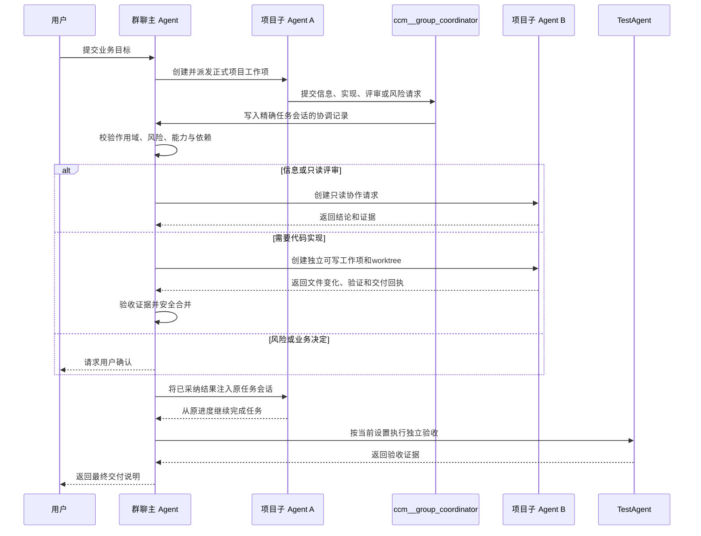

# 群聊项目子 Agent 跨项目协作流程

确认日期：2026-07-28  
实现状态：已完成并通过生产构建与完整业务链回归

## 业务目标

当群聊中的项目子 Agent A 需要另一个项目 B 提供信息、实现代码、执行评审或处理风险时，A 不能直接命令 B。A 只能通过内部协作 MCP 向群聊主 Agent 提交请求，由群聊主 Agent统一判断、派发、验收并恢复 A 的原任务会话。

该流程解决三个问题：

- 子 Agent之间可以真实协作，但不能绕过群聊主 Agent扩大权限。
- B 项目的新工作使用独立工作项、worktree和原生 Agent 会话，不打断 B 已经在执行的其他任务。
- 协作结果必须经过证据与合并门禁，不能仅凭进程退出码或自然语言声明完成。

## 适用范围

- 适用于由群聊主 Agent分派、绑定精确群聊会话的项目子 Agent任务。
- 支持 Claude Code、Cursor、Codex、Gemini、OpenCode 和 Qoder。
- 独立项目会话的开发 Agent不获得群聊协调 MCP；项目内部工作由项目主 Agent负责。
- TestAgent不通过该 MCP派发开发工作，它只负责独立验收。

## 角色边界

| 角色 | 责任 | 禁止行为 |
| --- | --- | --- |
| 用户 | 提供目标，在高风险、业务方向或权限不足时做决定 | 不需要直接管理子 Agent协议 |
| 群聊主 Agent | 仲裁请求、选择目标项目、创建工作项、跟踪依赖、验收和恢复来源任务 | 绕过任务系统直接授权跨项目写入 |
| 来源项目子 Agent A | 完成当前项目工作，提交协作需求、证据、验收标准和建议写入范围 | 直接命令 B、私自修改 B 项目或扩大 B 的权限 |
| 目标项目子 Agent B | 在正式工作项和授权路径内实现或提供只读回答 | 访问兄弟会话、其他项目或未授权路径 |
| TestAgent | 在主任务进入验收时独立复核真实结果 | 修改业务代码或替代主 Agent派发 |

## 完整流程



## 协作 MCP

内部服务名：`ccm__group_coordinator`

项目子 Agent可调用：

| 工具 | 用途 |
| --- | --- |
| `request_coordination` | 提交 `information`、`implementation`、`review` 或 `risk` 协作需求 |
| `request_review` | 请求群聊主 Agent安排另一个 Agent进行只读评审 |
| `report_blocker` | 报告权限、环境、风险或需要用户决策的阻塞 |
| `get_coordination_status` | 查询当前精确任务会话中的协调状态 |

MCP只负责“子 Agent向主 Agent提交协调请求”和状态查询。B 的开发回执、文件证据、验收结果和 A 的恢复由持久任务系统、任务时间线及主 Agent编排链处理，不是子 Agent之间通过 MCP直接互发消息。

## 精确作用域与安全门禁

每个协作 MCP 配置绑定：

- `groupId`
- `groupSessionId`
- `taskId`
- `sourceProject`
- `sourceTaskAgentSessionId`
- `sourceNativeSessionId`
- Agent运行时与工作目录

上下文使用统一 `CCM_INTERNAL_MCP_CONTEXT`：

- HMAC-SHA256签名并包含签发时间和失效时间。
- 每次调用重新读取权威任务、群聊配置和任务 Agent 会话进行核验。
- 任务已结束、项目退出群聊、子 Agent会话关闭、原生会话变化、作用域不一致、签名被篡改或令牌过期时立即拒绝。
- 提交、查询、幂等去重和群聊主 Agent claim 均包含精确 `group_session_id`，兄弟会话不能读取或认领。
- 调用进入统一内部 MCP审计；审计不保存 Prompt、密钥、工具结果正文或完整补丁。

## 实现类请求

`implementation` 请求不会降级成普通问答。群聊主 Agent创建：

- `workflow_type: agent_coordination_dependency`
- `queue_scope: isolated_parallel`
- 独立 worktree与独立原生 Agent会话
- 明确的 `allowed_paths`
- 必需的代码变化和验证证据
- 与来源任务关联的父子工作项

B 项目已有会话可以继续运行，新协作工作项不会复用或打断它。B 完成后，主 Agent检查结构化回执、真实文件变化、验证命令和阻塞项；只有验收通过并安全合并后才恢复 A。

## 状态流转

正常状态：

```text
submitted
-> triaged
-> waiting_agent | work_item_created | needs_user
-> executing
-> evidence_review
-> merging
-> resolved
-> resumed
```

异常状态：

- `merge_conflict`：保留独立工作区和证据，等待明确处理，不错误恢复 A。
- `failed`：实现或验收失败，来源任务保持等待或进入返工。
- `timeout`：目标 Agent超时，主 Agent记录证据并决定重试、改派或请求用户。
- `cancelled`：用户或上游任务取消，停止继续派发。

服务重启后会从持久协调记录、父子任务和 Agent续跑信息恢复；重复提交使用幂等键返回原请求，不重复创建工作项。

## 用户可见信息

用户在任务卡和任务回放中看到：

- 当前由哪个项目处理依赖。
- 正在等待、执行、验收、合并还是恢复原任务。
- 实际变更文件、验证结果、风险和未完成事项。
- 失败、冲突或需要用户决策的明确原因。

协议ID、原生session、Provider、MCP配置和审计字段默认进入折叠的排障信息，不作为聊天正文展示。

## 失败策略

- 缺少精确会话或任务 Agent会话时不注入协调 MCP。
- 运行时工具同步失败时阻止派发，不让子 Agent在工具缺失状态下假装可以协作。
- B 的退出码为 `0` 不代表完成；缺少文件变化或验证证据时不能合并。
- 合并冲突保留 worktree，禁止覆盖其他项目正在进行的改动。
- 主 Agent无法判断高风险请求时必须询问用户。
- 来源 Agent无法恢复时保留 `resolved` 状态并由恢复流程重试，不丢失已验收结果。

## 实现入口

- `backend/integrations/group-coordination-mcp.ts`
- `backend/integrations/internal-mcp-runtime.ts`
- `backend/integrations/agent-internal-mcp.ts`
- `backend/modules/collaboration/group-coordination-store.ts`
- `backend/modules/collaboration/collaboration-runtime-cross-agent-runtime.ts`
- `backend/modules/collaboration/collaboration-runtime-runtime-tools.ts`
- `backend/modules/collaboration/collaboration-runtime-task-queue.ts`

## 验证证据

- 协作 MCP JSON-RPC、签名、过期、篡改、结束任务、错误群聊会话和跨会话 claim 自测通过。
- Claude Code、Cursor、Codex、Gemini、OpenCode、Qoder运行时注入通过。
- A 请求 B、B 独立执行、worktree合并、服务重启恢复及 A 原会话续跑的完整业务链通过。
- 内部 MCP总回归验证 `8` 个内部 MCP、`44` 个工具、角色最小权限、TestAgent和交付门禁。
- Agent领域回归 `8/8` 通过，生产构建通过，付费 Provider调用为 `0`。

