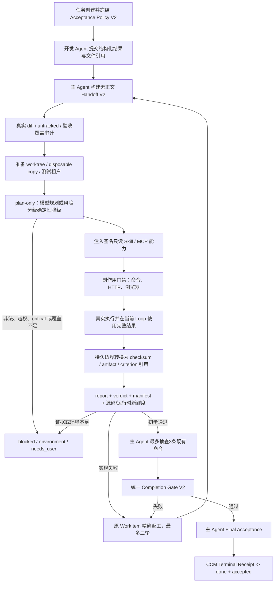

# TestAgent独立验收与主Agent自验完整业务流程

本文记录当前已经进入生产代码的任务验收流程。它适用于群聊自动开发、项目会话主Agent编排和直接项目任务。

全局主Agent不直接在跨项目父Mission中修改源码：它把实现拆成精确项目子任务，各子任务使用本文同一套V2验收链；全局父Mission只有在全部子任务Terminal/Completion Gate有效且全局汇总门禁通过后才可完成。因此全局、项目、群聊三条入口共享同一验收强度，同时维持全局控制面不越权写项目源码的边界。

## 一、任务创建时固定验收方式

1. 新任务创建时读取一次全局TestAgent设置。
2. 服务端新写`ccm-task-acceptance-policy-snapshot-v2`，绑定任务、群聊或项目、精确会话、generation、风险等级、规划降级、隔离、只读能力与完成门禁checksum；历史v1只读兼容。
3. 开启时固定为`test_agent`，最多三轮；关闭时固定为`main_agent_self_verification`，只允许一轮。
4. 设置修改只影响之后新建的任务。正在执行、等待确认、返工和恢复中的任务继续使用原快照。
5. 快照checksum、任务、scope或精确会话不匹配时失败关闭，不能在执行中切换验收方式。

## 二、TestAgent开启

```text
开发Agent完成工作
→ 主Agent形成独立验收工单
→ 独立读取真实Git diff并审计验收标准覆盖
→ 建立受控worktree/disposable copy或只读降级边界
→ TestAgent独立进程生成结构化计划（失败时按风险矩阵降级）
→ 注入签名只读Skill摘要与只读MCP Schema
→ 副作用安全门后执行命令、HTTP和浏览器检查
→ 校验无正文证据投影、artifact、源码与运行时指纹
→ 主Agent最多抽查3条既有关键命令
→ 生成ccm-test-agent-completion-gate-v2
→ 通过或生成精确返工证据
→ 最多三轮复验
→ 主Agent最终验收
```

- TestAgent不修改源码、测试、配置或依赖。
- TestAgent模型只能规划检查，确定性证据门禁计算最终结论。
- 规划Provider超时、连接失败或无效JSON时，lightweight可执行冻结检查；standard仅在所有标准已有明确检查映射时降级；interactive还必须具备预声明API/浏览器检查、隔离环境和测试租户；critical直接阻塞。非法handoff、权限越界和安全校验失败永不降级。
- Runner、证据校验、隔离清理、变更面或源码/运行时稳定性无法证明时不能降级为主Agent自验。
- 三轮后仍失败、环境缺失或需要产品决策时进入`blocked/needs_user`。

## 三、TestAgent关闭

```text
开发Agent完成工作
→ 对应主Agent读取系统捕获的文件变化
→ 执行项目已配置的安全验证命令
→ 模型只分析服务端分配的证据ID
→ 服务端逐条核验验收标准覆盖
→ 单轮通过或阻塞
→ 主Agent最终验收
```

- 不启动TestAgent进程，不生成独立验收结论，也不进入三轮返工循环。
- 开发Agent自己填写的“测试成功”不能作为通过证据。
- 模型返回`accepted=true`不会改变结果；最终结论由文件证据、命令退出码、证据ID和标准覆盖共同计算。
- 没有验证命令、命令失败或超时、缺少实际文件变化、模型不可用、JSON无效或证据不足时均失败关闭。
- 页面与回放明确显示“主Agent自验，未经过独立TestAgent”。

## 四、统一终态门禁

任务进入`done + accepted`前必须同时满足：

1. 验收策略快照有效且与当前任务、scope和会话一致。
2. TestAgent模式存在有效独立验收回执；自验模式存在有效`MainAgentSelfVerificationReceiptV1`。
3. 回执绑定策略checksum，且确定性门禁通过。
4. 存在`ccm-main-agent-final-acceptance-v1`最终验收记录。
5. 最终验收模式与任务快照一致。
6. v2任务必须存在checksum有效且所有子门均通过的`ccm-test-agent-completion-gate-v2`。

通用`delivery_summary.accepted=true`、自由文本中的“成功/通过/passed”以及开发Agent自报结果均不能单独完成自动开发任务。

## 五、恢复与历史兼容

- 新任务始终带正式快照。
- 旧任务已有明确`acceptance_mode`时首次恢复可惰性生成快照，之后保持不变。
- 同时存在冲突的TestAgent和自验历史时标记`legacy_acceptance_mode_ambiguous`并阻塞，不猜测。
- 群聊最终验收重新加载权威任务，避免内存中的旧task对象再次启用已关闭的独立验收门禁。
- v1 handoff/Runner/任务记录不会在启动时自动改写；已登录管理员通过`/api/test-agent/maintenance/preview`预览，提交精确任务、scope、session、planChecksum和原因后才可`apply`，每次执行先备份且可按jobId`rollback`。未登录用户和非管理员均被接口门禁拒绝。

## 六、当前实际工作流程图



## 七、实现入口

- 策略快照：`backend/modules/collaboration/task-acceptance-policy.ts`
- 主Agent自验：`backend/modules/collaboration/main-agent-self-verification.ts`
- 项目主Agent：`backend/modules/projects/project-main-agent.ts`
- 群聊与直接任务：`backend/modules/collaboration/collaboration-task-executor.ts`
- 群聊验收循环：`backend/modules/collaboration/collaboration-runtime-coordinator-review.ts`
- 统一终态门禁：`backend/modules/collaboration/collaboration-task-service.ts`
- 风险降级：`backend/test-agent/planning-fallback.ts`
- 无正文投影：`backend/test-agent/evidence-projection.ts`
- 隔离与副作用：`backend/test-agent/isolation.ts`、`backend/test-agent/isolation-execution-gate.ts`
- 真实变更面与运行时：`backend/test-agent/surface-audit.ts`、`backend/test-agent/runtime-fingerprint.ts`
- 只读能力：`backend/test-agent/readonly-capabilities.ts`
- V2完成门禁：`backend/test-agent/completion-gate.ts`
- 历史维护：`backend/test-agent/maintenance.ts`

## 八、验证证据

- `scripts/test-agent-acceptance-mode-production-selftest.mjs`真实执行安全验证命令，并覆盖通过、伪造证据、命令失败、模型失败、回执不匹配和独立验收缺失。
- `scripts/test-agent-settings-selftest.mjs`验证设置、页面和三条执行入口。
- `scripts/test-agent-review-policy-selftest.mjs`验证独立验收失败路由。
- `scripts/project-main-agent-orchestration-selftest.mjs`验证项目主Agent与TestAgent编排。
- `scripts/test-agent-v2-hardening-selftest.mjs`验证规划降级、投影、隔离、变更面、运行时、只读能力和统一完成门禁。
- `scripts/test-agent-maintenance-selftest.mjs`验证历史维护预览无正文、错误checksum拒绝、apply投影、rollback恢复与重复回滚幂等。
- 所有测试使用Mock Provider，付费调用为0。
