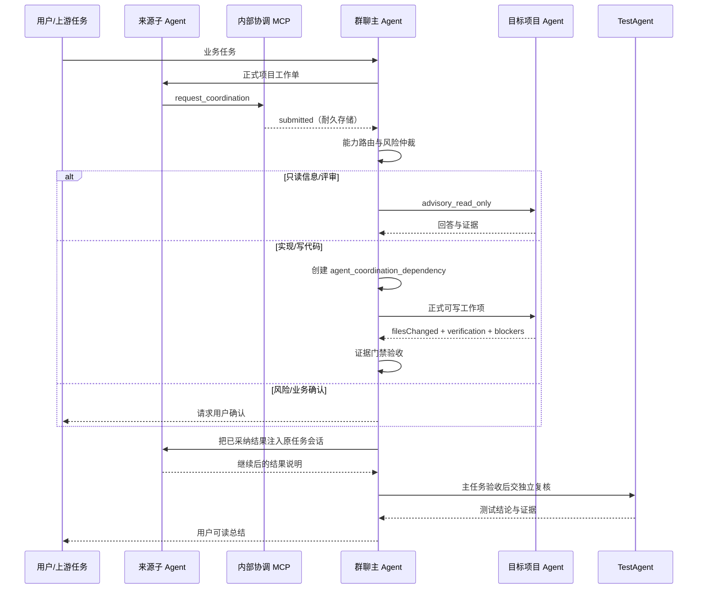

# 群聊主 Agent MCP 协作链 v1

日期：2026-07-15  
状态：已实现并完成真实协议、业务链和渲染回归

## 目标

把项目子 Agent 之间的协作从“子 Agent 直接指定并询问另一个子 Agent”升级为由群聊主 Agent 统一负责的完整链路：

1. 子 Agent 只能向群聊主 Agent 提交协调请求。
2. 群聊主 Agent 判断请求属于只读询问、正式可写工作项、风险确认或用户确认。
3. 写代码依赖必须创建独立项目工作项，不能借只读问答扩大写权限。
4. 目标 Agent 的结果必须经过证据门禁；通过后才恢复原 Agent 的任务会话。
5. 请求、工作项、验收和恢复状态必须可持久化、可回放、可在服务重启后继续处理。
6. 用户看到友好进度；协议、会话 ID、路由和证据评分默认收在“技术详情”。

## 角色边界

| 角色 | 可以做什么 | 不能做什么 |
| --- | --- | --- |
| 全局 Agent | 把复杂目标交给相应群聊主 Agent，接收最终总结 | 直接管理群内子 Agent 问答或 TestAgent 内部执行 |
| 群聊主 Agent | 计划、选择目标、创建工作项、维护依赖、验收、恢复原会话、交给 TestAgent | 绕过工作项给子 Agent 暗中扩大写权限 |
| 项目子 Agent | 完成自己的工作；用内部 MCP 报告信息、实现、评审或风险需要 | 直接给另一个项目子 Agent 派活或私下协调写操作 |
| 目标项目 Agent | 在主 Agent 的只读问答或正式工作项范围内回答/实现 | 自行扩大文件、项目、MCP 或授权范围 |
| TestAgent | 在群聊主 Agent 完成业务验收后执行独立复核 | 代替群聊主 Agent 派发项目开发工作 |

## 真实链路

## 内部 MCP

服务：`ccm__group_coordinator`

工具：

- `request_coordination`：提交 `information`、`implementation`、`review` 或 `risk` 请求。
- `request_review`：申请主 Agent 安排只读评审。
- `report_blocker`：报告权限、风险、环境或用户确认阻塞。
- `get_coordination_status`：查询当前任务会话的协调状态。

内部 MCP 配置绑定以下上下文：

- `groupId`
- `taskId`
- `groupSessionId`
- `sourceProject`
- `sourceAgentType`
- `sourceTaskAgentSessionId`
- `sourceNativeSessionId`
- `sourceWorkDir`

该 MCP 由平台写入每次任务调用的隔离运行时快照，不来自技能商城或用户工具目录，也不作为可删除的外部 MCP 展示。已经验证 Claude Code、Cursor、Codex、Gemini 和 Qoder 的原生配置格式。

## 状态与恢复

耐久文件：`~/.cc-connect/group-coordination-requests.json`

状态链：

`submitted -> triaged -> waiting_agent | work_item_created | needs_user -> evidence_review -> resolved -> resumed`

终止状态：`failed | timeout | cancelled`

可靠性措施：

- 文件锁保护并发修改。
- 临时文件、`fsync`、原子替换和 `.bak` 备份恢复。
- 任务会话与请求幂等键双重去重。
- 仲裁进程中断超过两分钟后允许主 Agent 重新 claim。
- 正式工作项通过 `parent_task_id` 和 `child_task_ids` 双向关联到来源任务。
- 生命周期同时进入任务时间线和 Agent 协作记录，可在任务回放中排查。
- 原 `agent-qa.json` 同步升级为锁保护的原子写入，避免并发回答覆盖。

## 写依赖验收门禁

`implementation` 请求不会进入只读问答。群聊主 Agent会创建 `workflow_type=agent_coordination_dependency` 的正式工作项，并要求：

- 回执状态为 `done`。
- 没有未解决 `blockers`。
- 请求声明写路径时必须存在 `filesChanged` 证据。
- 必须存在实际 `verification` 证据。

任一条件不满足时，工作项标记失败且原 Agent不会被错误唤醒。通过后，请求先进入 `resolved`，再调用原任务 Agent 的同一任务会话继续，成功后进入 `resumed`。

## 用户展示

- 写依赖显示为“主 Agent 已安排某成员处理依赖”，不再显示成子 Agent 私下互相派发。
- 工作中、验收通过、原任务继续等状态使用同一个 `AgentQaMessage` 组件。
- 协调请求 ID、工作项 ID、执行 ID、权限模式和证据评分仅在默认折叠的技术详情中出现。
- 普通问话不渲染协调工作项卡片。
- 桌面和 390px 移动端都验证了换行、无横向溢出和技术详情默认折叠。

## 验证记录

### 真实 MCP 与运行时

命令：`npm run test:group-coordination-mcp`

覆盖：

- 真实 JSON-RPC stdio `initialize`、`tools/list`、`tools/call`。
- 四个 MCP 工具可调用。
- 重复调用幂等。
- 新 Node 进程可读取重启前的状态。
- Claude Code、Cursor、Codex、Gemini、Qoder 配置均包含受保护内部 MCP。

### 业务端到端

命令：`npm run test:group-coordination-chain`

已验证顺序：

1. 前端 Agent 通过真实 MCP 提交 `implementation`。
2. 群聊主 Agent claim 请求。
3. 创建后端正式工作项。
4. 后端 Runner 实际写入 `src/orders-api.ts` 并返回验证证据。
5. 主 Agent 验收通过。
6. 恢复原前端任务会话，实际写入 `orders-client.ts`。
7. 请求、父子任务、消息和时间线均持久化供回放。

### Playwright 渲染

命令：`npm run test:group-coordination-render`

截图：

- `scratch/group-coordination-render/desktop-group-coordination.png`
- `scratch/group-coordination-render/mobile-group-coordination.png`

断言：普通问话无工作项、技术详情默认折叠、协议 ID 默认不可见、展开后可排障、桌面/移动端无溢出。

## 兼容策略

旧的 `ask_agent`、`request_review` 和 `CCM_AGENT_REQUESTS` 仍可被解析，但会先转换为协调请求写入主 Agent 存储，不再赋予子 Agent 直接派发语义。新提示词首选 MCP，并提供 `CCM_COORDINATION_REQUESTS` 作为不支持 MCP 的旧运行时降级格式。

## 关键文件

- `backend/integrations/group-coordination-mcp.ts`
- `backend/modules/collaboration/group-coordination-store.ts`
- `backend/modules/collaboration/collaboration.ts`
- `backend/modules/collaboration/agent-qa-service.ts`
- `backend/modules/collaboration/agent-qa-routes.ts`
- `backend/tools/runtime-tool-sync.ts`
- `frontend/src/components/agents/AgentQaMessage.vue`
- `scripts/group-coordination-mcp-selftest.mjs`
- `scripts/group-coordination-business-chain-e2e.mjs`
- `scripts/group-coordination-render-regression.mjs`

